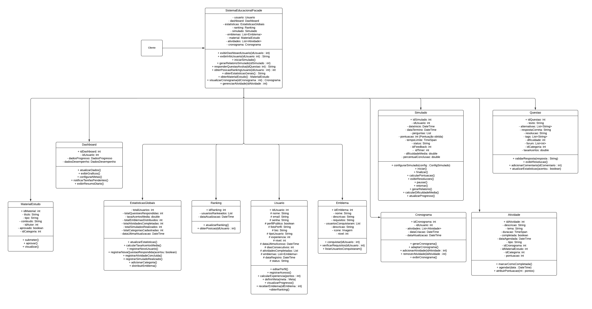
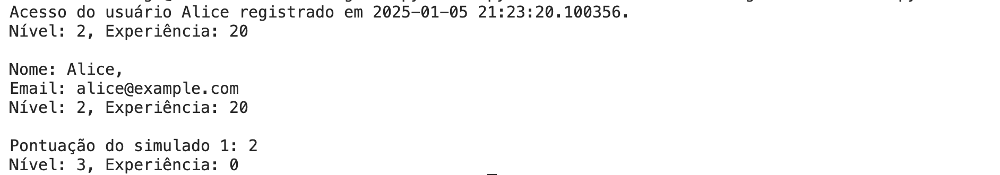

# **Facade**

## **1. Introdução**

O padrão de projeto Facade, pertencente à categoria de padrões estruturais, é um padrão que fornece uma interface simplificada para uma biblioteca, um framework, ou qualquer conjunto complexo de classes<sup>[1](./3.2.1.Facade.md#referências-bibliográficas)</sup>. O padrão Facade provê uma interface unificada para um conjunto de interfaces em um subsistema. Ele define uma interface de nível mais alto que torna o subsistema mais fácil de usar (Gamma et al., 1995)<sup>[2](./3.2.1.Facade.md#referências-bibliográficas)</sup>. Dessa forma, o Facade tem como principal objetivo reduzir a complexidade e promover um baixo acoplamento entre o cliente e os componentes internos de um sistema.

No contexto prático, o Facade é útil em situações onde é necessário fornecer um ponto de acesso único para funcionalidades amplas, como em sistemas com múltiplos módulos, melhorando a legibilidade do código, além de permitir futuras mudanças estruturais no subsistema sem impactar os clientes.

No nível de modelagem, o Facade é representado por uma classe que atua como uma fachada para um conjunto de classes, simplificando a interação do cliente com o sistema. Essa classe centraliza a comunicação com os subsistemas, ocultando a complexidade interna e fornecendo uma interface única e coesa para o cliente. A figura abaixo exemplifica a estrutura do padrão Facade.

<center>

<figure markdown>

<font size="3"><p style="text-align: center"><b>Imagem 1</b> - Exemplo estrutura facade</p></font>


<font size="3"><p style="text-align: center">Fonte: Refactoring Guru (2025) </p></font>

</figure>

</center>


## **2. Objetivo**

O padrão de projeto Facade tem como objetivo centralizar e simplificar a interação com os subsistemas do nosso projeto que é a plataforma de estudo para o ENEM, tornando o acesso a funcionalidades como criação de simulados, exibição de estatísticas globais, gerenciamento de atividades e configuração de cronogramas mais intuitivo. Através da classe SistemaEducacionalFacade, o projeto busca reduzir a complexidade percebida pelo cliente, permitindo que funcionalidades avançadas sejam acessadas por meio de uma interface única e de simples interpretação. Nessa abordagem os subsistemas internos, Simulado, Dashboard e Questao, são tratados de forma independente, promovendo baixo acoplamento e facilitando a manutenção e crescimento do sistema.

## **3. Metodologia**
A metodologia foi baseada em reuniões online para organizar e implementar o padrão estrutural Facade. Nas primeiras reuniões, o grupo focou no estudo detalhado do diagrama de classes apresentado, com ênfase na aplicação do padrão Facade para centralizar e simplificar a interação com os subsistemas. A equipe revisou o slide de Gofs Estruturais da professora Milene, responsável pela disciplina do projeto, o que forneceu uma base teórica sólida. Durante essas reuniões, os conceitos principais e as melhores práticas do padrão Facade foram discutidos. Com base nas discussões,estudos e o diagrama de classes, os integrantes do grupo começaram a esboçar o diagrama UML, identificando a classe SistemaEducacionalFacade como o ponto central de interação, encapsulando a complexidade dos subsistemas.

Utilizando o Lucidchart, foram definidos os elementos principais do diagrama, incluindo a classe Facade (SistemaEducacionalFacade) e seus subsistemas, como Dashboard, Simulado, EstatísticasGlobais, Questao, entre outros. O grupo alinhou a estrutura para garantir que o padrão Facade fosse aplicado corretamente, permitindo que a classe central orquestrasse a comunicação entre as funcionalidades do sistema, como exibição de gráficos, configuração de simulados e gerenciamento de atividades.


## **4. UML Facade**

<center>

<figure markdown>

<font size="3"><p style="text-align: center"><b>Imagem 2</b> - GoF Facade.</p></font>



<font size="3"><p style="text-align: center">Fonte: [Danilo Naves](https://github.com/DaniloNavesS), [Eric Silveira](https://github.com/ericbky),[Gustavo Roberto](https://github.com/gusrberto) e [Luiz Gustavo](https://github.com/LuizGust4vo)  </p></font>

</figure>

</center>

## **5. Código do UML Facade**

O código logo abaixo foi criado a partir do UML da Figura 1, seguindo a estrutura, seja na nomenclatura das classes e métodos, como também no padrão estrutural representado nela. Ele está organizado de acordo com essa estrutura, além da `main`, onde será iniciada a execução do programa. [Veja o código na íntegra](https://github.com/UnBArqDsw2024-2/2024.2_G3_Aprender_Entrega_03/blob/main/src/estruturais/facade.py)

---

#### **Classe `ConfigSimulado`**

```python
from datetime import timedelta

class ConfigSimulado:
    def __init__(self, tempo_limite: int, dificuldade: int):
        self.tempo_limite = tempo_limite
        self.dificuldade = dificuldade
```

<font size="3"><p style="text-align: center">Fonte: [Ana Carolina](https://github.com/CarolCoCe), [Felipe de Oliveira](https://github.com/M0tt1nh4), [Giovanni Giampauli](https://github.com/giovanniacg) e [João Artur](https://github.com/joao-artl)</p>
</font>

---

#### **Classe `Questao`**

```python
from typing import List

class Questao:
    def __init__(self, idQuestao: int, texto: str):
        self.idQuestao = idQuestao
        self.texto = texto
        self.alternativas: List[str] = []
        self.respostaCorreta: str = ""
        self.resolucao: str = ""
        self.tags: List[str] = []
        self.dificuldade: int = 0
        self.taxaAcertos: float = 0.0

    def validarResposta(self, resposta: str) -> bool:
        if resposta == self.respostaCorreta:
            return True
        else:
            return False

    def exibirResolucao(self):
        return f"Resolução: {self.resolucao}" if self.resolucao else "Nenhuma resolução disponível."

    def adicionarComentario(self, comentario: str):
        self.tags.append(comentario)
        return f"Comentário adicionado: {comentario}"
```

<font size="3"><p style="text-align: center">Fonte: [Ana Carolina](https://github.com/CarolCoCe), [Felipe de Oliveira](https://github.com/M0tt1nh4), [Giovanni Giampauli](https://github.com/giovanniacg) e [João Artur](https://github.com/joao-artl)</p>
</font>

---

#### **Classe `Simulado`**

```python
from datetime import datetime, timedelta
from typing import List

class Simulado:
    def __init__(self, idSimulado: int, idUsuario: int):
        self.idSimulado = idSimulado
        self.idUsuario = idUsuario
        self.dataInicio: datetime = None
        self.dataTermino: datetime = None
        self.perguntas: List[Questao] = []
        self.pontuacao: int = 0
        self.tempoLimite: timedelta = timedelta()
        self.status: str = "Não iniciado"

    def configurarSimulado(self, config: ConfigSimulado):
        self.tempoLimite = timedelta(minutes=config.tempo_limite)
        self.status = "Configurado"

    def iniciar(self):
        if not self.perguntas:
            raise ValueError("Não é possível iniciar um simulado sem perguntas.")
        self.dataInicio = datetime.now()
        self.status = "Em andamento"

    def finalizar(self):
        self.dataTermino = datetime.now()
        self.status = "Finalizado"

    def calcularPontuacao(self, respostas: List[str]):
        self.pontuacao = 0
        for pergunta, resposta in zip(self.perguntas, respostas):
            if pergunta.validarResposta(resposta):
                self.pontuacao += 1
        print(f"Pontuação do simulado {self.idSimulado}: {self.pontuacao}")
        return self.pontuacao

    def exibirResolucoes(self):
        return [questao.exibirResolucao() for questao in self.perguntas]
```

<font size="3"><p style="text-align: center">Fonte: [Ana Carolina](https://github.com/CarolCoCe), [Felipe de Oliveira](https://github.com/M0tt1nh4), [Giovanni Giampauli](https://github.com/giovanniacg) e [João Artur](https://github.com/joao-artl)</p>
</font>

---

#### **Classe `Usuario`**

```python
class Usuario:
    def __init__(self, idUsuario: int, nome: str, email: str, senha: str):
        self.idUsuario = idUsuario
        self.nome = nome
        self.email = email
        self.senha = senha
        self.perfilPublico: bool = False
        self.fotoPerfil: str = ""
        self.bio: str = ""
        self.experiencia: int = 0
        self.nivel: int = 1

    def registrarAcesso(self):
        return f"Acesso do usuário {self.nome} registrado em {datetime.now()}."

    def calcularExperiencia(self, pontos: int):
        self.experiencia += pontos
        if self.experiencia >= 100:
            self.nivel += self.experiencia // 100
            self.experiencia = self.experiencia % 100
        return f"Nível: {self.nivel}, Experiência: {self.experiencia}"
```

<font size="3"><p style="text-align: center">Fonte: [Ana Carolina](https://github.com/CarolCoCe), [Felipe de Oliveira](https://github.com/M0tt1nh4), [Giovanni Giampauli](https://github.com/giovanniacg) e [João Artur](https://github.com/joao-artl)</p>
</font>

---

#### **Classe `SistemaEducacionalFacade`**

```python
class SistemaEducacionalFacade:
    def __init__(self, usuario: Usuario, simulado: Simulado):
        self.usuario = usuario
        self.simulado = simulado

    def exibirInfoUsuario(self, idUsuario: int):
        if idUsuario == self.usuario.idUsuario:
            return f'''
Nome: {self.usuario.nome},
Email: {self.usuario.email}
Nível: {self.usuario.nivel}, Experiência: {self.usuario.experiencia}
'''

    def iniciarSimulado(self):
        self.simulado.iniciar()
        respostas_usuario = ["Brasília", "4", "Verde"]  # Uma resposta incorreta
        self.simulado.calcularPontuacao(respostas_usuario)
        self.simulado.finalizar()
```

<font size="3"><p style="text-align: center">Fonte: [Ana Carolina](https://github.com/CarolCoCe), [Felipe de Oliveira](https://github.com/M0tt1nh4), [Giovanni Giampauli](https://github.com/giovanniacg) e [João Artur](https://github.com/joao-artl)</p>
</font>

---

#### **Main**

```python
# Criando questões
questao1 = Questao(1, "Qual a capital do Brasil?")
questao1.respostaCorreta = "Brasília"

questao2 = Questao(2, "Quanto é 2 + 2?")
questao2.respostaCorreta = "4"

questao3 = Questao(3, "Qual a cor do céu durante o dia?")
questao3.respostaCorreta = "Azul"

# Criando simulado e configurando
simulado = Simulado(1, 123)
simulado.perguntas.extend([questao1, questao2, questao3])
simulado.configurarSimulado(ConfigSimulado(30, 2))

# Criando usuário
usuario = Usuario(1, "Alice", "alice@example.com", "senha123")
print(usuario.registrarAcesso())
print(usuario.calcularExperiencia(120))

# Usando o sistema educacional
sistema = SistemaEducacionalFacade(usuario, simulado)
print(sistema.exibirInfoUsuario(1))
sistema.iniciarSimulado()
print(usuario.calcularExperiencia(80))
```

<font size="3"><p style="text-align: center">Fonte: [Ana Carolina](https://github.com/CarolCoCe), [Felipe de Oliveira](https://github.com/M0tt1nh4), [Giovanni Giampauli](https://github.com/giovanniacg) e [João Artur](https://github.com/joao-artl)</p>
</font>

## **6. Saída do Código do UML Facade**

A execução do código apresentado na Figura 2 gera a seguinte saída no terminal:

<center>

<figure markdown>

<font size="3"><p style="text-align: center"><b>Imagem 2</b> - Código de saída</p></font>



<font size="3"><p style="text-align: center">Fonte: [Diego Sousa](https://github.com/DiegoSousaLeite)  </p></font>

</figure>

</center>


Essa saída demonstra o fluxo básico do sistema, desde o registro do acesso do usuário até a execução e avaliação do simulado. Ela confirma o funcionamento correto do padrão **Facade**, onde a classe `SistemaEducacionalFacade` centraliza a interação entre o usuário e os subsistemas (`Simulado` e `Questao`).

Esse resultado serve como uma prova de conceito inicial e será aprimorado futuramente para incluir uma interface gráfica que exiba as perguntas, respostas, e estatísticas de maneira mais amigável ao usuário.

## **7. Conclusão**

A aplicação do padrão de projeto Facade no desenvolvimento da nossa plataforma mostrou-se essencial para simplificar a interação entre as diferentes funcionalidades do sistema e garantir uma experiência coesa para o cliente. Ao consolidar operações complexas de diversos subsistemas, como a gestão de simulados, estatísticas globais, dashboard, e cronogramas, em uma única interface de acesso por meio da classe SistemaEducacionalFacade, o padrão promoveu a redução da complexidade percebida pelo cliente e o aumento da coesão entre os componentes.

Essa abordagem permitiu encapsular a lógica detalhada de subsistemas individuais (como Simulado, Questao e Atividade), delegando ao Facade a responsabilidade de orquestrar essas interações. Como resultado, o sistema é mais fácil de usar e mantém uma clara separação de responsabilidades, o que simplifica a manutenção, evolução e testes do software.

Além disso, o padrão Facade contribuiu para um design escalável, permitindo que novos subsistemas ou funcionalidades sejam integrados no futuro sem impactar a interface exposta ao cliente. Esse fator garante que o sistema possa evoluir de forma consistente e organizada, atendendo às crescentes necessidades dos usuários e requisitos educacionais.


## **Referências Bibliográficas**

> 1. REFACTORING GURU. Design Patterns: Facade. Disponível em: https://refactoring.guru/design-patterns/facade. Acesso em: 5 jan. 2025.

> 2. Gamma, E., Helm, R., Johnson, R., & Vlissides, J. (1995). Design Patterns: Elements of Reusable Object-Oriented Software. Addison-Wesley. Página 185

## **Histórico de Versão**

| Versão | Data | Descrição | Autor(es) | Revisor(es) |
| ------ | ---- | --------- | --------- | ---------- |
| `1.0`  | 05/01/2024 | Criação do documento  | [Diego Sousa](https://github.com/DiegoSousaLeite) | [Arthur Alves](https://github.com/arthrok), [Julio Cesar](https://github.com/julio-dourado) e [Paulo Henrique](https://github.com/paulomh)|
| `1.1`  | 05/01/2024 | Adição da sessão de introdução  | [Paulo Henrique](https://github.com/paulomh) | [Arthur Alves](https://github.com/arthrok), [Julio Cesar](https://github.com/julio-dourado) e [Diego Sousa](https://github.com/DiegoSousaLeite) |
| `1.2`  | 05/01/2024 | Adição da sessão de objetivo  | [Julio Cesar](https://github.com/julio-dourado) | [Arthur Alves](https://github.com/arthrok)|
| `1.3`  | 05/01/2024 | Adição dos códigos da UML | [Diego Sousa](https://github.com/DiegoSousaLeite) | [Arthur Alves](https://github.com/arthrok), [Julio Cesar](https://github.com/julio-dourado) e [Paulo Henrique](https://github.com/paulomh)|
| `1.4`  | 05/01/2024 | Adição da sessão de conclusão  | [Arthur Alves](https://github.com/arthrok) | [Julio Cesar](https://github.com/julio-dourado) |