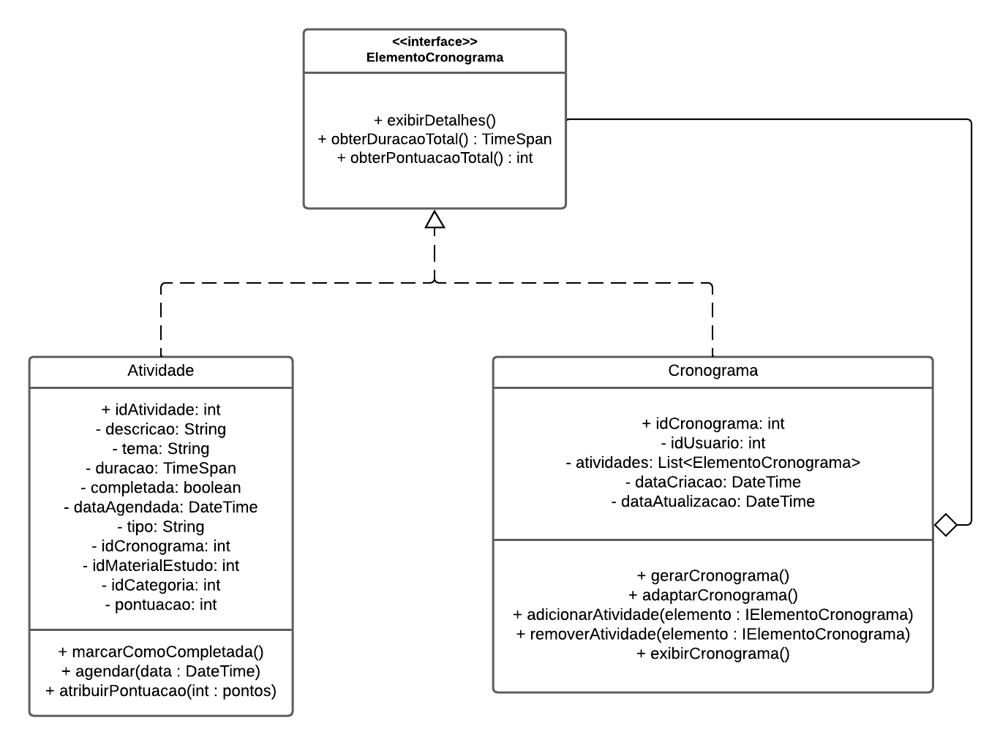
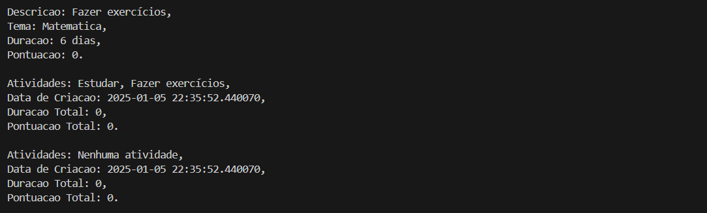

# **Composite**

## **1. Introdução**

O padrão de projeto Composite, pertencente à categoria de padrões estruturais definidos pelo Gang of Four (GOF), é amplamente utilizado para tratar objetos simples e compostos de maneira uniforme. De acordo com Gamma et al.<sup id="anchor_1"><a href="#REF1">1</a></sup> (1994), o Composite "compõe objetos em estruturas de árvore para representar hierarquias parte-todo", facilitando o design de sistemas complexos e escaláveis.

Larman<sup id="anchor_2"><a href="#REF2">2</a></sup> (2007) ressalta que o Composite é essencial em sistemas hierárquicos, como estruturas de arquivos e interfaces gráficas, promovendo flexibilidade e consistência. Além disso, Sommerville<sup id="anchor_3"><a href="#REF3">3</a></sup> (2007) enfatiza sua contribuição para a qualidade do software, permitindo maior coesão e reuso, enquanto Silva<sup id="anchor_4"><a href="#REF4">4</a></sup> (2007) destaca sua aplicação eficiente em modelagens UML. Esse padrão é indispensável em projetos que demandam organização e extensibilidade, sendo amplamente adotado na engenharia de software.

## **2. Objetivo**

O objetivo do padrão de projeto Composite, no contexto de uma plataforma de estudo para o ENEM, é estruturar cronogramas de forma flexível e organizada. Ele permite que o cronograma seja composto por elementos individuais, como atividades específicas (resolução de questões ou leitura de textos), e blocos maiores que agrupam essas atividades, como temas de Matemática ou Redação. Essa estrutura hierárquica possibilita que tanto atividades simples quanto compostas sejam tratadas de maneira uniforme, garantindo consistência e simplicidade na gestão do cronograma.

A aplicação do Composite também facilita a personalização dos cronogramas, permitindo que estudantes adicionem ou removam atividades conforme suas necessidades. Além disso, o progresso pode ser monitorado com métricas como porcentagem de conclusão e tempo dedicado, fornecendo uma visão clara do desempenho. Com a geração automática de cronogramas, a plataforma pode sugerir planos baseados no tempo disponível até o ENEM e nas dificuldades do estudante, otimizando seu preparo. Assim, a integração desse padrão oferece uma base eficiente para organizar e acompanhar os estudos de forma personalizada.

## **3. Metodologia**

Semelhante à metodologia aplicada no [padrão Facade](./3.2.1.Facade.md#3-metodologia), a equipe realizou encontros virtuais para analisar o diagrama de classes do projeto e avaliar a adoção do **Composite** no contexto do sistema de cronogramas. As principais etapas seguidas foram:

1. **Estudo Preliminar e Identificação de Possibilidades**  
   - Cada integrante pesquisou o padrão Composite em referências acadêmicas e analisou exemplos práticos de sua aplicação.  
   - Em paralelo, foi feito um levantamento das necessidades da plataforma de estudos, identificando onde hierarquias parte-todo se encaixariam de forma mais produtiva.

2. **Discussões Colaborativas e Planejamento Inicial**  
   - O time promoveu debates para alinhar a compreensão teórica e confirmar que o padrão Composite atenderia às exigências de flexibilidade e manutenção do cronograma.  
   - Foram levantadas hipóteses sobre como **Atividade** (folha) e **Cronograma** (composição) poderiam interagir, resultando em um esboço inicial de diagrama UML.

3. **Esboço e Refinamento do Diagrama UML**  
   - Utilizando o Lucidchart, a equipe formalizou a estrutura proposta, definindo interfaces, classes concretas e métodos necessários para tratar o cronograma como uma árvore hierárquica.  
   - Revisões periódicas foram realizadas para garantir que as classes respeitassem o princípio de responsabilidade única, facilitando a expansão futura.

4. **Implementação e Validação de Funcionalidades**  
   - A partir do diagrama consolidado, foi desenvolvido um protótipo em Python para demonstrar como **Atividades** e **Cronogramas** podem ser adicionados, removidos e manipulados.  
   - Foram criados testes práticos para verificar se o cálculo de **duração total** e **pontuação total** se comportava adequadamente em diferentes níveis de composição.

5. **Documentação e Ajustes Finais**  
   - O código resultante foi documentado de modo a evidenciar como o padrão Composite se integra ao restante do sistema, ressaltando suas vantagens em termos de manutenção e escalabilidade.  
   - Por fim, a equipe avaliou possíveis melhorias, mantendo um registro de como novos tipos de elementos (por exemplo, *Módulos* adicionais) poderiam ser incorporados sem modificar significativamente o **core** do padrão.

Essa abordagem iterativa, inspirada no processo adotado no [padrão Facade](./3.2.1.Facade.md#3-metodologia), possibilitou uma **aplicação clara** do Composite no sistema de cronogramas. Além de garantir uma estrutura flexível e coesa, a equipe consolidou um artefato de fácil expansão, capaz de acomodar novas funcionalidades conforme a plataforma de estudos evolua.


## **4. UML Composite**

Na modelagem, a interface ElementoCronograma estabelece uma abstração comum para todas as entidades manipuladas pelo cronograma. A classe Atividade implementa a interface como uma folha, fornecendo detalhes como descrição, duração e pontuação. Já a classe Cronograma, como uma composição, agrega múltiplos elementos e delega as operações (por exemplo, cálculo da duração total) para seus componentes. Essa estrutura modular facilita a manipulação uniforme de elementos simples e compostos, além de permitir expansões futuras, como a inclusão de novos tipos de elementos no cronograma.

<center>

<figure markdown>

<font size="3"><p style="text-align: center"><b>Imagem 1</b> - GoF Composite.</p></font>



<font size="3"><p style="text-align: center">Fonte: [Danilo Naves](https://github.com/DaniloNavesS), [Eric Silveira](https://github.com/ericbky),[Gustavo Roberto](https://github.com/gusrberto) e [Luiz Gustavo](https://github.com/LuizGust4vo)  </p></font>

</figure>

</center>

## **5. Código do UML Composite**

O código abaixo foi criado com base no diagrama UML apresentado na seção anterior. Ele está organizado de acordo com a estrutura do diagrama, além da `main`, onde será iniciada a execução do programa. [Veja o código na íntegra](https://github.com/UnBArqDsw2024-2/2024.2_G3_Aprender_Entrega_03/blob/main/src/estruturais/composite.py)

---

#### **Classe abstrata `ElementoCronograma`**

```python
from abc import ABC, abstractmethod
from datetime import datetime

class ElementoCronograma(ABC):
    @abstractmethod
    def exibirDetalhes(self):
        pass

    @abstractmethod
    def obterDuracaoTotal(self):  # int para simplificar o exemplo, utilizando a escala em dias
        pass

    @abstractmethod
    def obterPontuacaoTotal(self) -> int:
        pass
```

<font size="3"><p style="text-align: center">Fonte: [Ana Carolina](https://github.com/CarolCoCe), [Felipe de Oliveira](https://github.com/M0tt1nh4), [Giovanni Giampauli](https://github.com/giovanniacg) e [João Artur](https://github.com/joao-artl)</p>
</font>

---

#### **Classe `Atividade`**

```python
class Atividade(ElementoCronograma):
    def __init__(self, idAtividade: int, descricao: str, tema: str, duracao: int, idCronograma: int):
        self.idAtividade = idAtividade
        self.descricao = descricao
        self.tema = tema
        self.duracao = duracao
        self.completada = False
        self.idCronograma = idCronograma
        self.pontuacao = 0

    def exibirDetalhes(self):
        return f"""Descricao: {self.descricao},
Tema: {self.tema},
Duracao: {self.duracao} dias,
Pontuacao: {self.pontuacao}.
"""

    def obterDuracaoTotal(self) -> int:
        return self.duracao

    def obterPontuacaoTotal(self) -> int:
        return self.pontuacao

    def marcarComoCompletada(self):
        self.completada = True

    def atribuirPontuacao(self, pontos: int):
        self.pontuacao = pontos
```

<font size="3"><p style="text-align: center">Fonte: [Ana Carolina](https://github.com/CarolCoCe), [Felipe de Oliveira](https://github.com/M0tt1nh4), [Giovanni Giampauli](https://github.com/giovanniacg) e [João Artur](https://github.com/joao-artl)</p>
</font>

---

#### **Classe `Cronograma`**

```python
class Cronograma(ElementoCronograma):
    def __init__(self, idCronograma: int, atividades: list):
        self.idCronograma = idCronograma
        self.atividades = atividades
        self.dataCriacao = datetime.now()

    def exibirDetalhes(self):
        atividades = ""
        if self.atividades:
            atividades = ""
            for i in self.atividades:
                atividades += f"{i.descricao}, "

        return f"""Atividades: {atividades or "Nenhuma atividade,"}
Data de Criacao: {self.dataCriacao},
Duracao Total: {self.obterDuracaoTotal()},
Pontuacao Total: {self.obterPontuacaoTotal()}.
"""

    def obterDuracaoTotal(self):
        total = 0
        for i in self.atividades:
            total += i.obterDuracaoTotal()

        return total

    def obterPontuacaoTotal(self) -> int:
        total = 0
        for i in self.atividades:
            total += i.obterPontuacaoTotal()

        return total

    def adicionarAtividade(self, elemento: ElementoCronograma):
        self.atividades.append(elemento)

    def removerAtividade(self, elemento: ElementoCronograma):
        self.atividades.remove(elemento)
```

<font size="3"><p style="text-align: center">Fonte: [Ana Carolina](https://github.com/CarolCoCe), [Felipe de Oliveira](https://github.com/M0tt1nh4), [Giovanni Giampauli](https://github.com/giovanniacg) e [João Artur](https://github.com/joao-artl)</p>
</font>

---

#### **Main**

```python
if __name__ == "__main__":
    cronograma = Cronograma(1, [])

    atividade1 = Atividade(1, "Estudar", "Matematica", 3, 1)
    print(atividade1.exibirDetalhes())
    atividade2 = Atividade(2, "Fazer exercícios", "Matematica", 6, 1)
    print(atividade2.exibirDetalhes())

    cronograma.adicionarAtividade(atividade1)
    cronograma.adicionarAtividade(atividade2)
    print(cronograma.exibirDetalhes())

    cronograma.removerAtividade(atividade1)
    cronograma.removerAtividade(atividade2)
    print(cronograma.exibirDetalhes())
```

<font size="3"><p style="text-align: center">Fonte: [Ana Carolina](https://github.com/CarolCoCe), [Felipe de Oliveira](https://github.com/M0tt1nh4), [Giovanni Giampauli](https://github.com/giovanniacg) e [João Artur](https://github.com/joao-artl)</p>
</font>

## **6. Saída do Código do UML Composite**

Ao executar o código apresentado, a seguinte saída é gerada no terminal:

<center>

<figure markdown>

<font size="3"><p style="text-align: center"><b>Imagem 2</b> - Código de saída</p></font>



<font size="3"><p style="text-align: center">Fonte: [Paulo Souza](https://github.com/paulomh)  </p></font>

</figure>

</center>

## **7. Conclusão**

A implementação do padrão de projeto Composite no contexto do sistema de cronogramas para a plataforma de estudos revelou-se essencial para organizar e tratar elementos hierárquicos de maneira uniforme. Esse padrão permitiu representar a relação parte-todo entre atividades individuais e cronogramas completos, fornecendo uma estrutura flexível e extensível. A interface `ElementoCronograma` serviu como base para o tratamento genérico dos elementos, enquanto as classes `Atividade` e `Cronograma` possibilitaram a integração de objetos simples e compostos de forma consistente.

A principal vantagem dessa abordagem foi a simplificação da manipulação de cronogramas complexos, ao delegar responsabilidades às instâncias específicas e promover o reuso de código. Como resultado, funcionalidades como cálculo de duração e pontuação total puderam ser aplicadas de forma uniforme, independentemente do nível de granularidade dos componentes. Essa uniformidade também facilitou a manutenção e futura extensão do sistema, permitindo, por exemplo, a introdução de novos tipos de elementos no cronograma sem alterações significativas na lógica existente.

## **Referências Bibliográficas**

> <a id="REF1" href="#anchor_1">1.</a> Gamma, E., Helm, R., Johnson, R., & Vlissides, J. (1994). Design Patterns: Elements of Reusable Object-Oriented Software. Addison-Wesley.
> 
> <a id="REF2" href="#anchor_2">2.</a> Larman, C. (2007). Utilizando UML e Padrões: Uma Introdução à Análise e ao Projeto Orientado a Objetos. 3ª edição. Bookman.
> 
> <a id="REF3" href="#anchor_3">3.</a> Sommerville, I. (2007). Engenharia de Software. 8ª edição. Pearson.
> 
> <a id="REF4" href="#anchor_4">4.</a> Silva, R. P. (2007). UML 2 em Modelagem Orientada a Objetos. Visual Books.


## **Histórico de Versão**

| Versão | Data | Descrição | Autor(es) | Revisor(es) |
| ------ | ---- | --------- | --------- | ---------- |
| `1.0`  | 05/01/2024 | Criação do documento  | [Diego Sousa](https://github.com/DiegoSousaLeite) | [Arthur Alves](https://github.com/arthrok), [Julio Cesar](https://github.com/julio-dourado) e [Paulo Henrique](https://github.com/paulomh)|
| `1.1`  | 05/01/2024 | Adição da sessão de metodologia, diagrama uml e código uml  | [Paulo Henrique](https://github.com/paulomh) | [Arthur Alves](https://github.com/arthrok), [Julio Cesar](https://github.com/julio-dourado) e [Diego Sousa](https://github.com/DiegoSousaLeite) |
| `1.2`  | 05/01/2024 | Adição da sessão de objetivo  | [Arthur Alves](https://github.com/arthrok) | [Julio Cesar](https://github.com/julio-dourado) |
| `1.3`  | 05/01/2024 | Adição da sessão de conclusão  | [Julio Cesar](https://github.com/julio-dourado) | [Arthur Alves](https://github.com/arthrok)|
| `1.4`   | 06/01/2025 | - | Refinamento da metodologia | [Giovanni Giampauli](https://github.com/giovanniacg) | - | - |