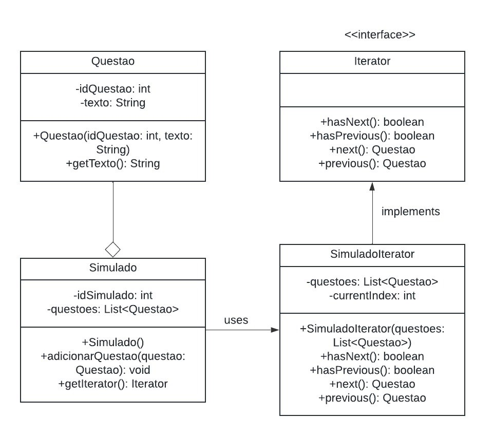
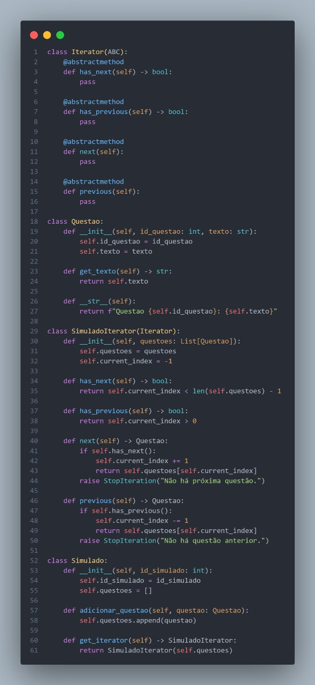

# **Iterator**

## **1. Introdução**

O padrão de projeto **Iterator** é classificado como um padrão **comportamental**, pois se concentra em como os objetos interagem e trocam informações entre si. Sua principal função é permitir percorrer elementos de coleções complexas sem expor a estrutura interna dessas coleções, proporcionando maior **encapsulamento** e **modularidade** no código. 

Quando aplicado em cenários com listas, árvores ou outras estruturas de dados, o Iterator atua como um mecanismo que separa as responsabilidades de armazenamento e de navegação, tornando o código mais fácil de manter e **evoluir**. Além disso, sua adoção pode gerar benefícios na **escalabilidade** de aplicações, pois cada parte do sistema (coleção e iterador) passa a ter papéis bem delimitados. Isso também abre espaço para a implementação de diferentes estratégias de iteração – por exemplo, navegar apenas em elementos que atendem a determinadas condições ou mesmo permitir múltiplos iteradores atuando simultaneamente sobre a mesma coleção.

No contexto deste projeto, o Iterator foi empregado para viabilizar a travessia de questões em simulados, permitindo que a lógica de iteração seja **compartilhada** entre diferentes módulos sem forçar o restante do sistema a conhecer detalhes de armazenamento. Assim, o comportamento de iteração foi encapsulado em uma classe dedicada, propiciando um **código mais limpo**, de fácil compreensão e alinhado a princípios de **projeto orientado a objetos**.


## **2. Metodologia**

O desenvolvimento do diagrama e da implementação do Iterator envolveu etapas que conciliam pesquisa, modelagem e práticas de revisão interna pelo time, conforme descritas a seguir:

1. **Estudo Individual e Convergência de Ideias**  
   - Cada membro do **Squad 1** estudou o padrão Iterator de forma independente, revisando materiais teóricos e exemplos de aplicações práticas.  
   - Posteriormente, foram realizadas discussões em grupo para alinhar conceitos e **identificar** as necessidades específicas do projeto, definindo onde e como o Iterator seria melhor aplicado.

2. **Brainstorming e Reuniões de Planejamento**  
   - Com base no conhecimento prévio, o grupo promoveu **sessões de brainstorm** para decidir as classes-alvo do padrão Iterator, selecionando as que possuíam potencial para se beneficiar de uma iteração mais flexível.  
   - Nessas reuniões, também foi definido o escopo do **GoF** relacionado ao Iterator, garantindo que o diagrama refletisse a real estrutura de iteração e suas interações no projeto.

3. **Modelagem UML**  
   - Foi criado um **Diagrama de Classes** para representar visualmente a aplicação do Iterator, descrevendo interfaces, classes e métodos responsáveis pela navegação na coleção.  
   - O diagrama foi revisado em conjunto, a fim de **validar** se as responsabilidades estavam bem distribuídas e se a arquitetura atendia aos princípios de baixo acoplamento e alta coesão.

4. **Prototipagem e Codificação**  
   - Após a definição do diagrama, a equipe implementou o Iterator em linguagem de programação escolhida, garantindo a aderência aos padrões **GoF** e à especificação UML.  
   - Foram criados exemplos funcionais para **testar** o comportamento do iterador, incluindo a navegação tanto para frente quanto para trás na coleção de questões.

5. **Validação e Revisão Interna**  
   - O código e o diagrama resultantes foram apresentados ao grupo para uma **revisão técnica**, assegurando conformidade com os requisitos e clareza na representação do padrão.  
   - Caso fossem identificadas inconsistências ou oportunidades de melhoria, o time realizaria ajustes pontuais na implementação e voltaria ao diagrama para refletir as alterações.

6. **Documentação Final e Análise Crítica**  
   - Foram documentados os principais pontos de decisão, motivações para o uso do Iterator, bem como as vantagens e limitações observadas durante o desenvolvimento.  
   - Uma **análise final** ressaltou como o padrão contribuiu para o isolamento da lógica de iteração, a maior flexibilidade na manipulação de coleções e a manutenção do código.

Esse processo evidenciou a importância de uma abordagem iterativa e colaborativa, onde teoria e prática se complementam. O resultado final foi um **artefato robusto** que não apenas cumpre seu papel funcional, mas também se mantém **aberto** a futuras expansões, refletindo boas práticas de engenharia de software na adoção do padrão Iterator.

## **3. Diagramas**

 A interface Iterator estabelece uma abstração comum para a navegação em coleções. A classe Questao funciona como a unidade básica da coleção, representando uma questão individual com atributos como identificador e texto. Já a classe Simulado age como uma composição, agrupando múltiplas questões e delegando a lógica de iteração para a classe SimuladoIterator.

O SimuladoIterator implementa a interface Iterator e fornece métodos específicos para navegar pelos elementos da coleção. Essa estrutura modular permite a manipulação uniforme de coleções simples (Questao) e compostas (Simulado).

<center>

<figure markdown>
<font size="3"><p style="text-align: center"><b>Imagem 1</b> - GoF Iterator</p></font>



<font size="3"><p style="text-align: center">Fonte: [Paulo Henrique](https://github.com/paulomh), [Diegou Sousa](https://github.com/DiegoSousaLeite), [Arthur Alves](https://github.com/arthrok), [Julio Cesar](https://github.com/julio-dourado)</p></font>

</figure>

</center>

## **4. Implementação**

Códigos do GoF Comportamental - Iterator

[Veja o código na íntegra](https://github.com/UnBArqDsw2024-2/2024.2_G3_Aprender_Entrega_03/blob/main/src/comportamentais/iterator-simulado.py)

<center>

<figure markdown>
<font size="3"><p style="text-align: center"><b>Imagem 2</b> Códigos Iterator</p></font>



<font size="3"><p style="text-align: center">Fonte: [Danilo Naves](https://github.com/DaniloNavesS), [Eric Silveira](https://github.com/ericbky), [Gustavo Roberto](https://github.com/gusrberto) e [Luiz Gustavo](https://github.com/LuizGust4vo)</p></font>

</figure>

</center>

**Saída do Código**

Ao executar o código acima, a saída será:

```
Navegando para frente:
Questao 1: O que é POO?
Questao 2: O que é Herança?
Questao 3: O que é Polimorfismo?

Navegando para trás:
Questao 2: O que é Herança?
Questao 1: O que é POO?
```

## **6. Análise e conclusão**

Por meio de uma abordagem modular, o uso do Iterator permitiu encapsular os detalhes de navegação, fornecendo uma interface unificada para percorrer os elementos de uma coleção. O diagrama apresentado destaca a relação entre as classes e interfaces, demonstrando como a lógica de iteração foi separada da lógica de armazenamento de dados, promovendo a reutilização de código e facilitando a manutenção do sistema. Além disso, o exemplo prático mostrou, de maneira clara, como o Iterator pode ser aplicado a um cenário real, possibilitando a navegação tanto para frente quanto para trás em uma coleção de questões. Simplificando a navegação em coleções, além de promover flexibilidade e organização no design do sistema.

## **Referências Bibliográficas**

> <a id="REF1" href="#anchor_1">1.</a> Iterator, Refactoring Guru. Disponível em: [https://refactoring.guru/pt-br/design-patterns/iterator](https://refactoring.guru/pt-br/design-patterns/iterator). Acesso em: 03 de jan de 2025.

> <a id="REF2" href="#anchor_2">2.</a> Diagrama de Classes, G3. Disponível em: [https://unbarqdsw2024-2.github.io/2024.2_G3_Aprender_Entrega_02/#/Modelagem/2.1.2.DiagramaClasses](https://unbarqdsw2024-2.github.io/2024.2_G3_Aprender_Entrega_02/#/Modelagem/2.1.2.DiagramaClasses). Acesso em: 03 de jan de 2025.

> <a id="REF3" href="#anchor_3">3.</a> Brain Storming, G3. Disponível em: [https://unbarqdsw2024-2.github.io/2024.2_G3_Aprender_Entrega_01/#/Artefatos/brainstorming](https://unbarqdsw2024-2.github.io/2024.2_G3_Aprender_Entrega_01/#/Artefatos/brainstorming). Acesso em: 03 de jan de 2025.

> <a id="REF4" href="#anchor_4">4.</a> Código Iterator, Squad 3. Disponível em: [Código](https://github.com/UnBArqDsw2024-2/2024.2_G3_Aprender_Entrega_03/blob/main/src/comportamentais/iterator-simulado.py)

## **Histórico de Versão**

| Versão | Data       | Data de Revisão          | Descrição            | Autor(es)                       | Revisor(es)                       | Detalhes da revisão        |
| ------ | ---------- | ------------------------ | -------------------- | ------------------------------- | --------------------------------- | -------------------------- |
| `1.0`| 05/01/2025 | 05/01/2025 | Criação do Documento | [Felipe Motta](https://github.com/M0tt1nh4) | [Ana Carolina](https://github.com/CarolCoCe), [Giovanni Giampauli](https://github.com/giovanniacg), [João Artur Leles](https://github.com/joao-artl) | - |
| `1.1`   | 06/01/2025 | - | Refinamento da introdução e metodologia | [Giovanni Giampauli](https://github.com/giovanniacg) | - | - |
