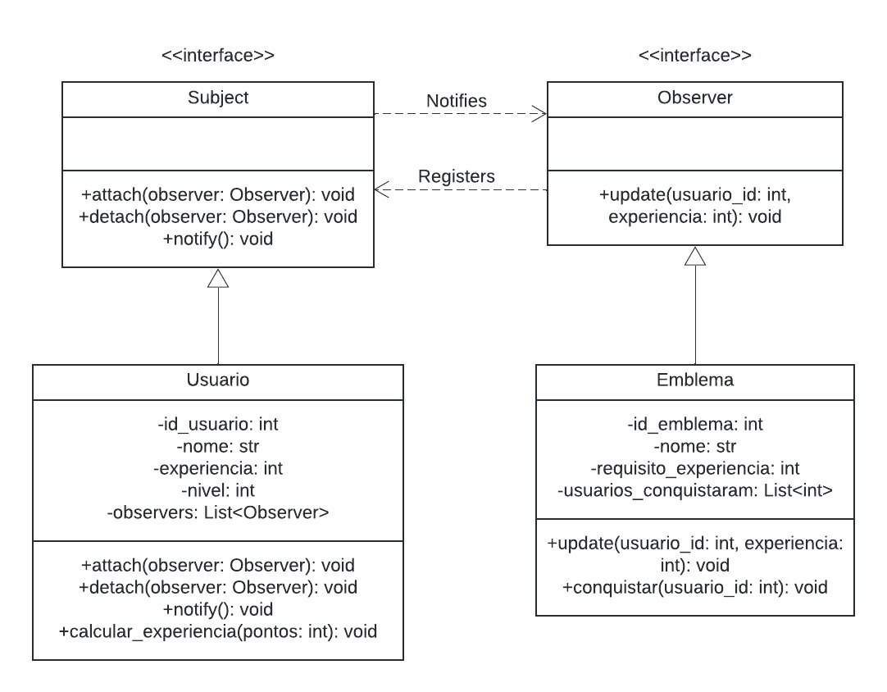
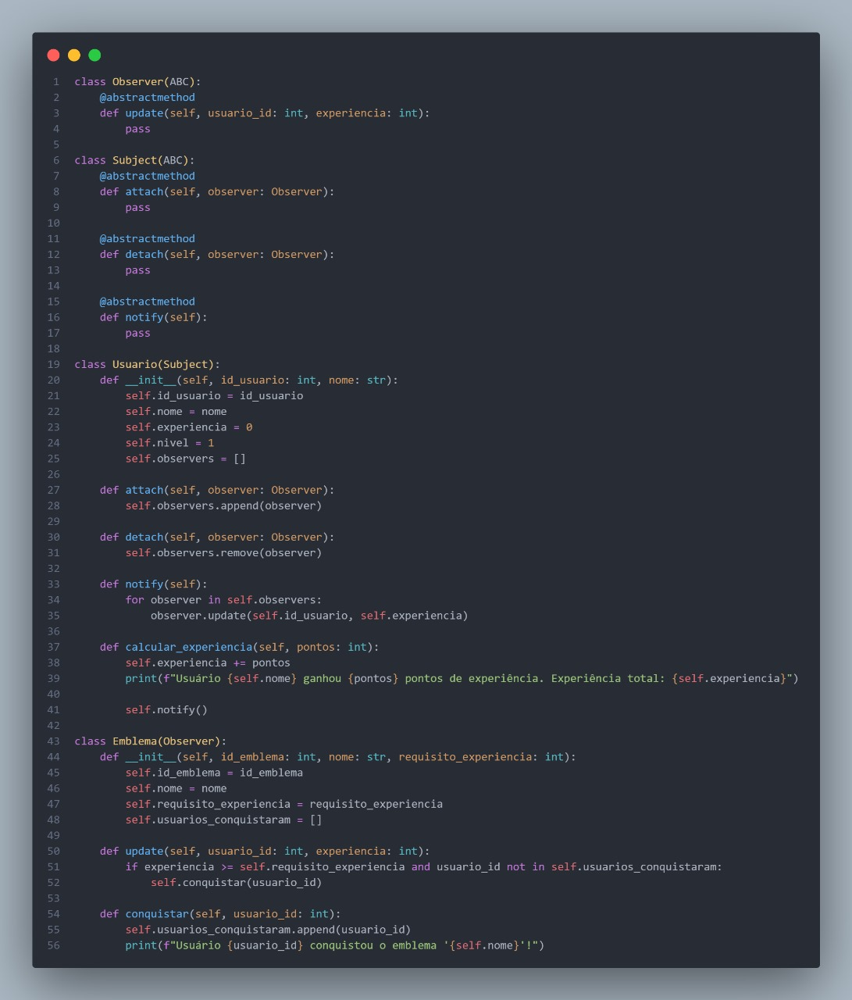

# **Observer**

## **1. Introdução**

O padrão de projeto **Observer** pertence ao grupo dos padrões **comportamentais** e tem como objetivo estabelecer um mecanismo de **notificação** entre objetos de forma desacoplada. Em outras palavras, ele permite que um objeto — comumente chamado de *Subject* ou *Observable* — informe a múltiplos observadores sobre alterações em seu estado, sem precisar conhecer detalhes de implementação ou dependências específicas de cada *Observer*.

Essa abordagem contribui para a **flexibilidade** e **extensibilidade** do sistema, pois novos observadores podem ser adicionados ou removidos sem modificar a lógica central do *Subject*. Além disso, a divisão clara de responsabilidades facilita a manutenção, reduzindo a complexidade do código ao **separar** a lógica de notificação da lógica de negócios principal. O padrão Observer se torna particularmente valioso em cenários como: interfaces gráficas, sistemas de evento ou até mesmo mecanismos de *logging* e monitoramento de estado.

No contexto deste documento, o **Observer** foi aplicado para gerenciar a notificação de eventos relacionados ao progresso de usuários (conquistas emblema) e também para o controle de timers em simulados, mostrando como múltiplos componentes podem *reagir* a mudanças no sistema sem que o objeto principal precise lidar diretamente com cada observador.


## **2. Metodologia**

A construção do diagrama e dos exemplos de código para o padrão Observer seguiu um **processo iterativo**, combinando pesquisa teórica e práticas colaborativas da equipe, conforme descrito a seguir:

1. **Estudos Individuais e Preparação**  
   - Cada membro do **Squad 1** dedicou-se à leitura de materiais sobre o padrão Observer, **investigando** exemplos reais de uso e boas práticas de implementação.  
   - Foram mapeados os pontos do projeto que se beneficiariam de uma arquitetura mais descentralizada, na qual diversos componentes precisavam ser notificados de mudanças em um objeto principal.

2. **Discussões e Brainstorming**  
   - Em reuniões de **brainstorm**, a equipe alinhou a aplicação do Observer nos domínios de *Emblemas-Usuário* e *Timer-Simulado*, discutindo como eventos de atualização deveriam disparar notificações a cada um dos observadores.  
   - Referências de entregas anteriores e o diagrama de classes foram empregados para delimitar o escopo do padrão, garantindo que a modelagem fosse aderente às necessidades do projeto.

3. **Modelagem UML**  
   - Foi criado um **diagrama de classes** representando o *Subject* (por exemplo, `Usuario` ou `Timer`) e diferentes classes que implementam a interface *Observer* (por exemplo, `Emblema` ou `Simulado`).  
   - Esse diagrama incluiu métodos essenciais (como `attach`, `detach` e `update`) e clarificou como cada observador seria notificado. O modelo foi **revisado** em conjunto, assegurando clareza e coesão arquitetural.

4. **Prototipagem de Código**  
   - A partir do diagrama, desenvolveu-se um **protótipo funcional** em linguagem de programação escolhida para validar o comportamento do Observer em cenários distintos (controle de pontuação do usuário e timer de simulados).  
   - Foram adicionados **casos de teste** práticos para garantir que cada evento disparado pelo *Subject* fosse corretamente recebido pelos observadores registrados.

5. **Validação e Refinamentos**  
   - Realizou-se uma análise crítica do código e do diagrama para verificar se as notificações ocorriam de maneira consistente e se havia pontos de melhoria, como redução de acoplamento ou simplificação de métodos.  
   - Foram feitos ajustes pontuais na implementação, assegurando que o padrão **Observer** seguisse as boas práticas de **design orientado a objetos** e promovesse alta **manutenibilidade**.

6. **Documentação e Exemplificação**  
   - Ao final, a equipe produziu **exemplos ilustrativos** (códigos e saídas de execução) que comprovam o funcionamento do Observer, demonstrando cenários reais em que observadores reagem a alterações no estado do sujeito.  
   - Essa documentação foi consolidada em formato de texto e diagrama UML, de modo que servisse como **referência** para futuras expansões do projeto ou para a integração de novos desenvolvedores na equipe.

Por meio dessa metodologia que combina **exploração individual**, **colaboração em grupo** e **validação prática**, foi possível criar um **artefato** que evidencia o potencial do padrão Observer para lidar com cenários de múltiplas notificações. Os exemplos de *Emblemas-Usuário* e *Timer-Simulado* demonstram claramente os benefícios de manter as responsabilidades separadas entre o objeto observado e seus observadores, resultando em maior robustez e **evolutividade** do sistema.

## **3. Diagramas**

A interface Subject define os métodos básicos para gerenciar os observadores. A classe Usuario implementa essa interface, representando o sujeito observado.

A interface Observer define o método update, que é chamado pelo sujeito para informar os observadores sobre mudanças no estado. A classe Emblema implementa essa interface, representando um observador que monitora o progresso do usuário.

Essa estrutura modular permite que múltiplos emblemas monitorem o progresso de um usuário sem que o sujeito (Usuario) precise conhecer detalhes sobre seus observadores.

<center>

<figure markdown>
<font size="3"><p style="text-align: center"><b>Imagem 1</b> - GoF Observer</p></font>



<font size="3"><p style="text-align: center">Fonte: [Paulo Henrique](https://github.com/paulomh), [Diegou Sousa](https://github.com/DiegoSousaLeite), [Arthur Alves](https://github.com/arthrok), [Julio Cesar](https://github.com/julio-dourado)</p></font>

</figure>

</center>

## **4. Implementação**

Códigos do GoF Comportamental - Observer - Emblema-Usuário

[Veja o código na íntegra](https://github.com/UnBArqDsw2024-2/2024.2_G3_Aprender_Entrega_03/blob/main/src/comportamentais/observer-emblema-usuario.py)

<center>

<figure markdown>
<font size="3"><p style="text-align: center"><b>Imagem 2</b> Códigos Observer</p></font>



<font size="3"><p style="text-align: center">Fonte: [Danilo Naves](https://github.com/DaniloNavesS), [Eric Silveira](https://github.com/ericbky), [Gustavo Roberto](https://github.com/gusrberto) e [Luiz Gustavo](https://github.com/LuizGust4vo)</p></font>

</figure>

</center>

**Saída do Código**

Ao executar o código acima, a saída será:

```
Usuário João ganhou 5 pontos de experiência. Experiência total: 5
Usuário João ganhou 10 pontos de experiência. Experiência total: 15
Usuário 1 conquistou o emblema 'Iniciante'!
Usuário João ganhou 40 pontos de experiência. Experiência total: 55
Usuário 1 conquistou o emblema 'Veterano'!
```


Códigos do GoF Comportamental - Observer - Timer

[Veja o código na íntegra](https://github.com/UnBArqDsw2024-2/2024.2_G3_Aprender_Entrega_03/blob/main/src/comportamentais/observer-timer-simulado.py)

<center>

<figure markdown>
<font size="3"><p style="text-align: center"><b>Imagem 3</b> Códigos Observer</p></font>


<font size="3"><p style="text-align: center">Fonte: [Danilo Naves](https://github.com/DaniloNavesS), [Eric Silveira](https://github.com/ericbky), [Gustavo Roberto](https://github.com/gusrberto) e [Luiz Gustavo](https://github.com/LuizGust4vo)</p></font>

</figure>

</center>

**Saída do Código**

Ao executar o código acima, a saída será:

```
Timer iniciado.
Simulado 1 atualizado. Novo estado: iniciado
Simulado 2 atualizado. Novo estado: iniciado
Tempo limite atingido. Timer finalizado.
Simulado 1 atualizado. Novo estado: finalizado
Simulado 1 foi finalizado automaticamente.
Simulado 2 atualizado. Novo estado: finalizado
Simulado 2 foi finalizado automaticamente.
```

## **6. Análise e conclusão**

O padrão de projeto Observer permite que múltiplos objetos sejam notificados de mudanças no estado de um sujeito de forma desacoplada. A estrutura apresentada, com a interface Subject e os observadores independentes, promove flexibilidade e escalabilidade, facilitando a adição de novos observadores sem impactar o código existente.

Os exemplos ilustram o monitoramento do progresso de conquistas e controle de timers em simulados, evidenciando a função do Observer no gerenciamento do sistema. Dessa forma, problemas como comunicação entre objetos torna-se quase nula, mantendo os princípios de design modular e reutilização.

## **Referências Bibliográficas**

> <a id="REF1" href="#anchor_1">1.</a> Observer, Refactoring Guru. Disponível em: [https://refactoring.guru/pt-br/design-patterns/observer](https://refactoring.guru/pt-br/design-patterns/observer). Acesso em: 03 de jan de 2025.

> <a id="REF2" href="#anchor_2">2.</a> Diagrama de Classes, G3. Disponível em: [https://unbarqdsw2024-2.github.io/2024.2_G3_Aprender_Entrega_02/#/Modelagem/2.1.2.DiagramaClasses](https://unbarqdsw2024-2.github.io/2024.2_G3_Aprender_Entrega_02/#/Modelagem/2.1.2.DiagramaClasses). Acesso em: 03 de jan de 2025.

> <a id="REF3" href="#anchor_3">3.</a> Brain Storming, G3. Disponível em: [https://unbarqdsw2024-2.github.io/2024.2_G3_Aprender_Entrega_01/#/Artefatos/brainstorming](https://unbarqdsw2024-2.github.io/2024.2_G3_Aprender_Entrega_01/#/Artefatos/brainstorming). Acesso em: 03 de jan de 2025.

> <a id="REF4" href="#anchor_4">4.</a> Código Observer Emblema-Usuário, Squad 3. Disponível em: [Código](https://github.com/UnBArqDsw2024-2/2024.2_G3_Aprender_Entrega_03/blob/main/src/comportamentais/observer-emblema-usuario.py)

> <a id="REF5" href="#anchor_5">5.</a> Código Observer Timer, Squad 3. Disponível em: [Código](https://github.com/UnBArqDsw2024-2/2024.2_G3_Aprender_Entrega_03/blob/main/src/comportamentais/observer-timer-simulado.py)

## **Histórico de Versão**

| Versão | Data       | Data de Revisão          | Descrição            | Autor(es)                       | Revisor(es)                       | Detalhes da revisão        |
| ------ | ---------- | ------------------------ | -------------------- | ------------------------------- | --------------------------------- | -------------------------- |
| `1.0`| 05/01/2025 | 05/01/2025 | Criação do Documento | [Felipe Motta](https://github.com/M0tt1nh4) | [Ana Carolina](https://github.com/CarolCoCe), [Giovanni Giampauli](https://github.com/giovanniacg), [João Artur Leles](https://github.com/joao-artl) | - |
| `1.1`   | 06/01/2025 | - | Refinamento da introdução e metodologia | [Giovanni Giampauli](https://github.com/giovanniacg) | - | - |
