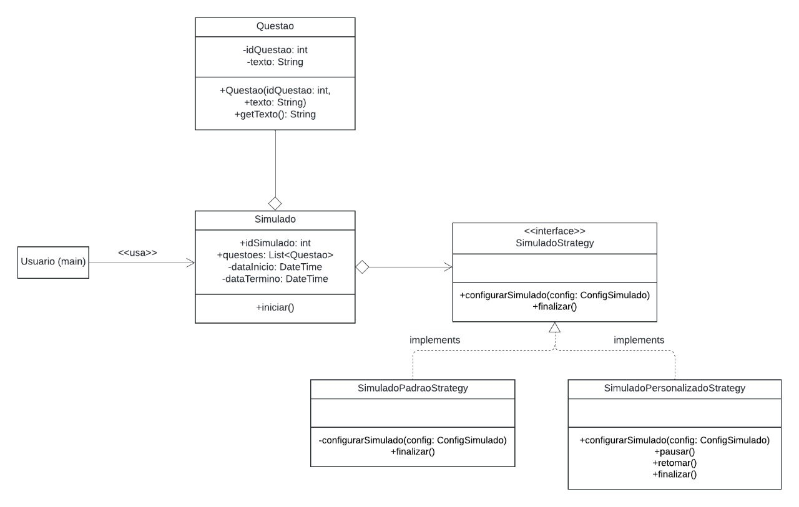
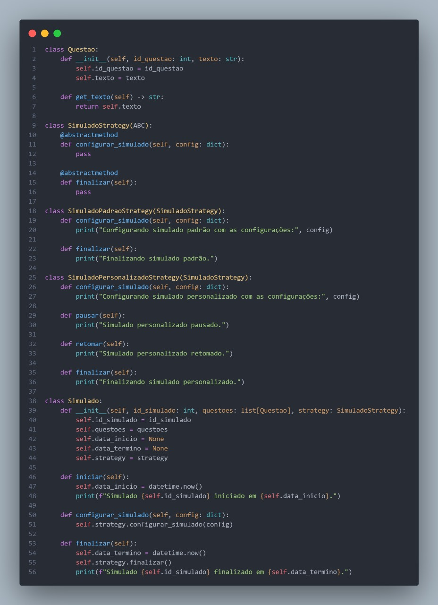

# **Strategy**

## **1. Introdução**

O padrão de projeto **Strategy** é classificado como um **padrão comportamental**, pois foca em como as classes e objetos interagem ao **trocar** comportamentos de forma **dinâmica**. Ele propõe a definição de uma **família de algoritmos** encapsulados em classes separadas, denominadas *estratégias*. Assim, ao invés de manter múltiplas variações de um mesmo algoritmo em uma única classe, o Strategy promove a **modularização** do código, possibilitando a fácil substituição de comportamentos em tempo de execução.

Essa abordagem resolve problemas de **manutenção**, evitando que um objeto centralizado se torne responsável por várias formas de executar uma mesma tarefa. Desse modo, cada *estratégia* atende a um propósito específico, permitindo que a aplicação seja **estendida** ou **alterada** sem impactos significativos nos módulos que dependem desses algoritmos. Além disso, o Strategy se alinha a princípios de **baixo acoplamento** e **alta coesão**, uma vez que cada variante de comportamento é mantida em uma classe própria, facilitando tanto a **compreensão** quanto a evolução do sistema.

No contexto deste documento, o padrão Strategy foi adotado na implementação de um sistema de simulados, possibilitando que diferentes estratégias de **configuração** e **finalização** sejam aplicadas de acordo com as necessidades do usuário ou do contexto. O objetivo é evidenciar como a separação de algoritmos em classes distintas reduz a complexidade e promove a **reutilização** de código, demonstrando na prática o potencial do Strategy em cenários de comportamentos voláteis.


## **2. Metodologia**

Para o desenvolvimento do diagrama UML e da implementação do padrão Strategy, o **Squad 1** seguiu uma abordagem que une estudos individuais, discussões de grupo e aplicação prática, conforme descrito a seguir:

1. **Estudos Individuais e Contextualização**  
   - Cada integrante do time pesquisou o conceito de Strategy em literatura especializada e exemplos de código existentes, entendendo suas vantagens e pontos de atenção.  
   - Paralelamente, foi levantado o **contexto** específico do projeto, mapeando cenários em que diferentes modos de configuração e finalização de simulados se tornariam relevantes.

2. **Reuniões de Brainstorm e Elaboração do Diagrama**  
   - Após o estudo individual, realizaram-se reuniões em que cada membro trouxe **ideias** e exemplos práticos de utilização do Strategy.  
   - Em conjunto, foi elaborado o [Diagrama de Classes](https://unbarqdsw2024-2.github.io/2024.2_G3_Aprender_Entrega_02/#/Modelagem/2.1.2.DiagramaClasses), definindo as principais entidades: `Simulado`, `SimuladoStrategy`, `SimuladoPadraoStrategy`, `SimuladoPersonalizadoStrategy` e demais componentes necessários à comunicação entre as classes.

3. **Refinamento da Arquitetura**  
   - A equipe validou o diagrama propondo cenários de uso e testando a coerência das relações entre classes.  
   - Ajustes pontuais foram feitos para assegurar **clareza** na aplicação do padrão, garantindo que cada estratégia fosse isolada em sua própria classe e que o objeto principal (`Simulado`) fosse capaz de alternar dinamicamente entre estratégias.

4. **Implementação e Testes**  
   - Com o diagrama consolidado, o time partiu para a **codificação**, criando as classes de estratégia e um ambiente de teste que ilustrasse a troca de comportamentos em tempo de execução.  
   - Foram realizados **testes unitários** e exemplos de uso no console, de modo a verificar a coerência das estratégias (por exemplo, iniciar e finalizar um simulado com estratégias diferentes) e a saída esperada.

5. **Validação e Documentação**  
   - O grupo revisou o código gerado, identificando possíveis melhorias e garantindo aderência aos princípios de **design orientado a objetos**.  
   - Por fim, foi criada a **documentação** do artefato, incluindo o diagrama UML e trechos de código exemplificativos, além de explicações sobre como estender ou substituir algoritmos conforme novas necessidades do sistema.

Essa metodologia **iterativa** e **colaborativa** buscou não apenas assegurar a **correção** do padrão Strategy no contexto do sistema de simulados, mas também promover o aprendizado contínuo de boas práticas. O resultado reflete a adoção efetiva do Strategy, demonstrando a facilidade de incorporar novos comportamentos à aplicação sem modificar substancialmente o restante do código.

## **3. Diagramas**

A classe Questao representa a unidade básica do sistema, contendo atributos como idQuestao e texto, que identificam e armazenam o conteúdo de uma questão. Já a classe Simulado atua como uma agregação de questões e possui informações relacionadas ao início e término do simulado.

A interface SimuladoStrategy define o contrato para diferentes estratégias de configuração e finalização do simulado. Duas implementações concretas dessa interface são fornecidas:

* SimuladoPadraoStrategy: Representa a estratégia padrão para configuração e finalização do simulado. Seu comportamento é mais básico e direto.
* SimuladoPersonalizadoStrategy: Fornece uma estratégia mais flexível, adicionando métodos adicionais como pausar e retomar, além de permitir configurações personalizadas.

A relação entre Simulado e SimuladoStrategy é de composição, o que permite que o comportamento do simulado seja definido de acordo com a estratégia selecionada. O Usuario, por sua vez, utiliza a classe Simulado para interagir com o sistema de questões e estratégias.

<center>

<figure markdown>
<font size="3"><p style="text-align: center"><b>Imagem 1</b> - GoF Strategy</p></font>



<font size="3"><p style="text-align: center">Fonte: [Paulo Henrique](https://github.com/paulomh), [Diegou Sousa](https://github.com/DiegoSousaLeite), [Arthur Alves](https://github.com/arthrok), [Julio Cesar](https://github.com/julio-dourado)</p></font>

</figure>

</center>

## **4. Implementação**

Códigos do GoF Comportamental - Strategy

[Veja o código na íntegra](https://github.com/UnBArqDsw2024-2/2024.2_G3_Aprender_Entrega_03/blob/main/src/comportamentais/simulado-strategy.py)

<center>

<figure markdown>
<font size="3"><p style="text-align: center"><b>Imagem 2</b> Códigos Strategy</p></font>



<font size="3"><p style="text-align: center">Fonte: [Danilo Naves](https://github.com/DaniloNavesS), [Eric Silveira](https://github.com/ericbky), [Gustavo Roberto](https://github.com/gusrberto) e [Luiz Gustavo](https://github.com/LuizGust4vo)</p></font>

</figure>

</center>

**Saída do Código**

Ao executar o código acima, a saída será:

```
Simulado 101 iniciado em 2025-01-05 23:28:45.314051.
Configurando simulado padrão com as configurações: {'duracao': '60 minutos', 'nivel': 'intermediário'}
Finalizando simulado padrão.
Simulado 101 finalizado em 2025-01-05 23:28:45.314158.


Simulado 102 iniciado em 2025-01-05 23:28:45.314182.
Configurando simulado personalizado com as configurações: {'duracao': '120 minutos', 'nivel': 'avançado'}
Simulado personalizado pausado.
Simulado personalizado retomado.
Finalizando simulado personalizado.
Simulado 102 finalizado em 2025-01-05 23:28:45.314241.
```

## **6. Análise e conclusão**

O padrão Strategy permitiu a substituição de comportamentos em tempo de execução sem alterar o código do cliente. A separação dos algoritmos em classes específicas promove a reutilização e facilita a manutenção, conforme ilustrado pelos exemplos de configuração de simulados.

Os diagramas e a implementação destacam a composição entre Simulado e SimuladoStrategy, evidenciando como diferentes estratégias podem ser aplicadas para atender a requisitos distintos. Sendo bom para lidar com comportamentos dinâmicos.

## **Referências Bibliográficas**

> <a id="REF1" href="#anchor_1">1.</a> Strategy, Refactoring Guru. Disponível em: [https://refactoring.guru/pt-br/design-patterns/strategy](https://refactoring.guru/pt-br/design-patterns/strategy). Acesso em: 03 de jan de 2025.

> <a id="REF2" href="#anchor_2">2.</a> Diagrama de Classes, G3. Disponível em: [https://unbarqdsw2024-2.github.io/2024.2_G3_Aprender_Entrega_02/#/Modelagem/2.1.2.DiagramaClasses](https://unbarqdsw2024-2.github.io/2024.2_G3_Aprender_Entrega_02/#/Modelagem/2.1.2.DiagramaClasses). Acesso em: 03 de jan de 2025.

> <a id="REF3" href="#anchor_3">3.</a> Brain Storming, G3. Disponível em: [https://unbarqdsw2024-2.github.io/2024.2_G3_Aprender_Entrega_01/#/Artefatos/brainstorming](https://unbarqdsw2024-2.github.io/2024.2_G3_Aprender_Entrega_01/#/Artefatos/brainstorming). Acesso em: 03 de jan de 2025.

> <a id="REF4" href="#anchor_4">4.</a> Códgio Strategy, Squad 3. Disponível em: [Código](https://github.com/UnBArqDsw2024-2/2024.2_G3_Aprender_Entrega_03/blob/main/src/comportamentais/simulado-strategy.py)

## **Histórico de Versão**

| Versão | Data       | Data de Revisão          | Descrição            | Autor(es)                       | Revisor(es)                       | Detalhes da revisão        |
| ------ | ---------- | ------------------------ | -------------------- | ------------------------------- | --------------------------------- | -------------------------- |
| `1.0`| 05/01/2025 | 05/01/2025 | Criação do Documento | [Felipe Motta](https://github.com/M0tt1nh4) | [Ana Carolina](https://github.com/CarolCoCe), [Giovanni Giampauli](https://github.com/giovanniacg), [João Artur Leles](https://github.com/joao-artl) | - |
| `1.1`   | 06/01/2025 | - | Refinamento da introdução e metodologia | [Giovanni Giampauli](https://github.com/giovanniacg) | - | - |
