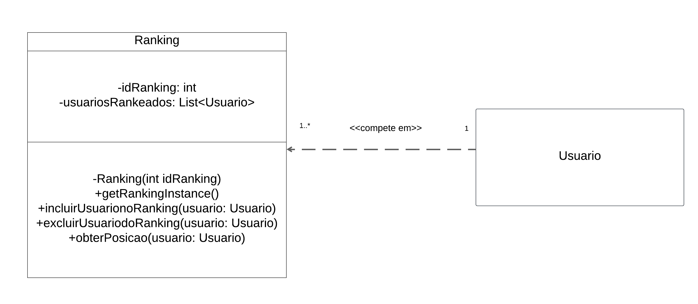
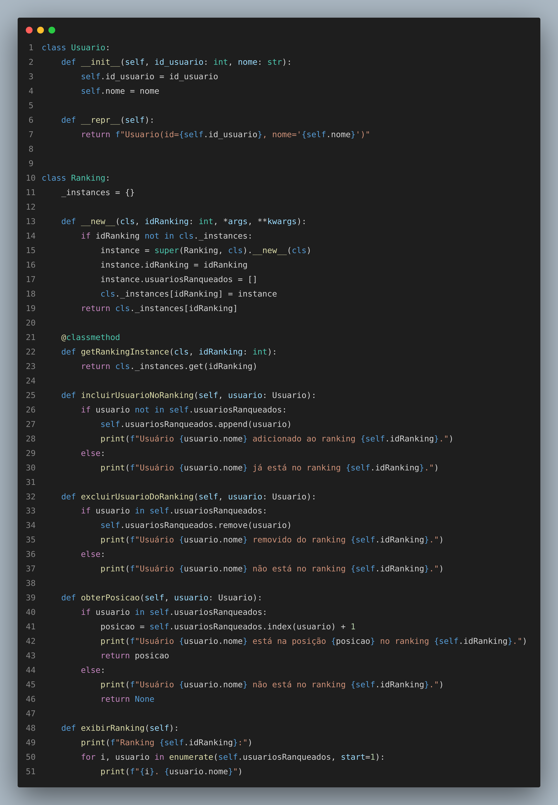
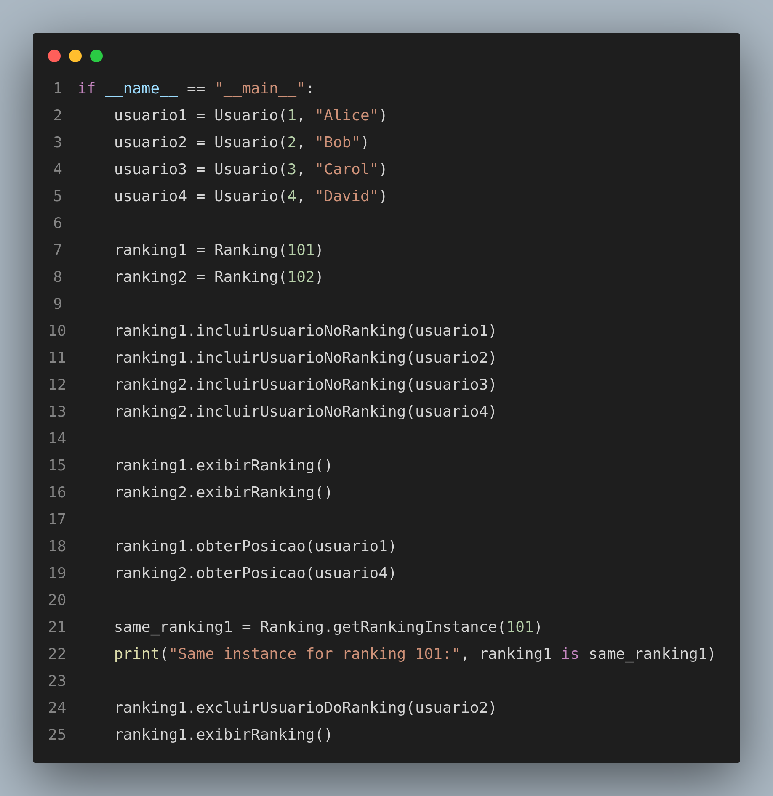
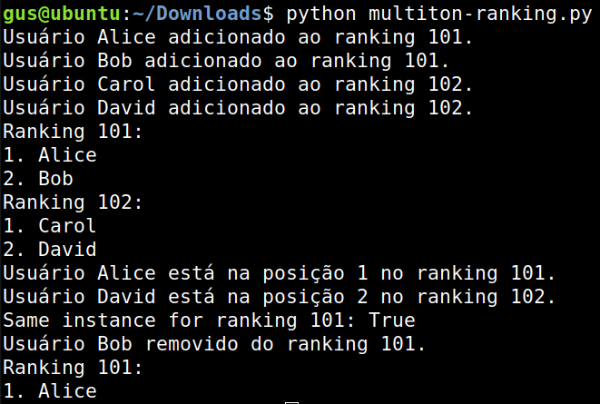

# **Documento de Padrão de Projeto GoF Criacional - Multiton**

## **1. Introdução**

A evolução constante das aplicações de software demanda soluções mais flexíveis para gerenciar recursos e informações compartilhadas. Enquanto o padrão Singleton limita-se a garantir apenas uma instância única de uma classe, o Multiton expande esse conceito ao permitir a criação de diferentes instâncias de acordo com chaves específicas, fornecendo maior flexibilidade e controle em cenários com múltiplas entidades semelhantes.

Neste documento, detalhamos a aplicação do Multiton à classe `Ranking`, empregada na plataforma para gerenciar o ranqueamento de usuários. Cada ranking é identificado por um ID único, assegurando que apenas uma instância exista para cada chave. Serão discutidos os princípios fundamentais do Multiton, seus objetivos no contexto do sistema de ranqueamento, e as vantagens observadas na prática, reforçados por um diagrama UML, trechos de código exemplificativos e uma análise final da implementação.

Essa abordagem proporciona não apenas um controle centralizado de cada ranking, mas também otimiza recursos ao evitar a criação de múltiplos objetos redundantes. Assim, o Multiton cumpre um papel fundamental em cenários nos quais a coexistência de múltiplas instâncias organizadas por chave se mostra imprescindível, trazendo clareza e eficiência ao projeto.

## **2. Metodologia**

Para a elaboração deste documento, utilizamos uma abordagem prática baseada na interpretação do nosso [diagrama de classes](https://unbarqdsw2024-2.github.io/2024.2_G3_Aprender_Entrega_02/#/Modelagem/2.1.2.DiagramaClasses). As etapas incluíram:

- Identificar os conceitos fundamentais do padrão Multiton.
- Implementar o padrão em um cenário prático de rankings.
- Validar a implementação por meio de exemplos concretos.

O uso do Multiton oferece diversos benefícios, incluindo:

- **Controle centralizado:** Garante uma única instância para cada ID de ranking, evitando inconsistências.
- **Economia de recursos:** Reduz o consumo de memória ao reutilizar instâncias existentes.
- **Facilidade de acesso:** Permite recuperar instâncias existentes por meio de uma chave única.

## **3. Diagrama**

O diagrama foca na parte do sistema de gerenciamento de rankings para os simulados. Cada ranking é identificado por um ID único e armazena uma lista de usuários ranqueados. O padrão Multiton foi escolhido para garantir que cada ranking tenha uma única instância associada ao seu ID.

<figure markdown>

<b>Imagem 1 -</b> Diagrama Multiton

Fonte: [Ana Carolina](https://github.com/CarolCoCe), [Felipe de Oliveira](https://github.com/M0tt1nh4), [Giovanni Giampauli](https://github.com/giovanniacg) e [João Artur](https://github.com/joao-artl)

</figure>

## **4. Código**

[Veja o código na íntegra](https://github.com/UnBArqDsw2024-2/2024.2_G3_Aprender_Entrega_03/blob/main/src/criacionais/multiton-ranking.py)

<figure markdown>

<b>Imagem 2 -</b> Código Multiton

Fonte: [Arthur Alves](https://github.com/Arthrok), [Diego Sousa](https://github.com/DiegoSousaLeite), [Julio Cesar](https://github.com/julio-dourado) e [Paulo Henrique](https://github.com/paulomh)

</figure>

### **4.1 Classe Usuario**

A classe `Usuario` representa os participantes do ranking. Seus atributos e métodos incluem:

- **Atributos:**
  - `id_usuario` (int): Identificador único do usuário.
  - `nome` (str): Nome do usuário.

- **Métodos:**
  - `__repr__`: Retorna uma representação textual do objeto.

### **4.2 Classe Ranking**

A classe `Ranking` implementa o padrão Multiton, garantindo uma instância única para cada ID de ranking. Seus principais elementos incluem:

- **Atributos:**
  - `_instances` (dict): Armazena as instâncias criadas, indexadas pelos IDs dos rankings.
  - `idRanking` (int): Identificador único do ranking.
  - `usuariosRanqueados` (list): Lista de usuários incluídos no ranking.

- **Métodos:**
  - `__new__`: Sobrescreve a criação de instâncias para implementar o Multiton.
  - `getRankingInstance`: Retorna a instância de um ranking com base no ID fornecido.
  - `incluirUsuarioNoRanking`: Adiciona um usuário ao ranking.
  - `excluirUsuarioDoRanking`: Remove um usuário do ranking.
  - `obterPosicao`: Retorna a posição de um usuário no ranking.
  - `exibirRanking`: Exibe os usuários ranqueados e suas posições.

### **4.3 Relacionamento entre Usuario e Ranking**

Conforme o diagrama UML fornecido, o relacionamento entre `Usuario` e `Ranking` é do tipo "1 para muitos", indicando que um usuário pode competir em vários rankings, enquanto cada ranking é associado a múltiplos usuários.

### **4.4 Exemplo de execução do código**

Aqui um código que exemplifica o funcionamento das classes do código:

<figure markdown>

<b>Imagem 3 -</b> Código Main

Fonte: [Arthur Alves](https://github.com/Arthrok), [Diego Sousa](https://github.com/DiegoSousaLeite), [Julio Cesar](https://github.com/julio-dourado) e [Paulo Henrique](https://github.com/paulomh)

</figure>

Aqui a saída do código acima:

<figure markdown>

<b>Imagem 4 -</b> Saída do Código

Fonte: [Gustavo Melo](https://github.com/gusrberto)

</figure>

## **5. Análise e Conclusão**

A implementação do padrão Multiton na classe `Ranking` demonstra uma aplicação eficiente desse padrão em sistemas que exigem instâncias únicas para chaves específicas. O código fornecido segue boas práticas de programação, garantindo a separação de responsabilidades entre as classes `Usuario` e `Ranking`.

## **Referências Bibliográficas**

> 1. GAMMA, Erich; HELM, Richard; JOHNSON, Ralph; VLISSIDES, John. **Design patterns: elements of reusable object-oriented software**. Boston: Addison-Wesley Professional, 1995.

> 2. Medium. *Multiton Pattern*. Disponível em: [https://medium.com/@codechuckle/demystifying-design-patterns-multiton-pattern-859b50638a9f](https://medium.com/@codechuckle/demystifying-design-patterns-multiton-pattern-859b50638a9f). Acesso em: 03 jan. 2025. 

> 3. Python Software Foundation. (n.d.). *Python Documentation*. Disponível em: [https://docs.python.org/](https://docs.python.org/). Acesso em: 03 jan. 2025.

> 4. Código Multiton, Squad 1. Disponível em: [Código](https://github.com/UnBArqDsw2024-2/2024.2_G3_Aprender_Entrega_03/blob/main/src/criacionais/multiton-ranking.py)

## **Histórico de Versão**

| Versão | Data       | Data de Revisão | Descrição do Documento                         | Autor(es)                                                | Revisor(es)                                       | Detalhes da revisão                                                                                         |
|-------|------------|-----------------|-------------------------------------------------|----------------------------------------------------------|---------------------------------------------------|-------------------------------------------------------------------------------------------------------------|
| `1.0`   | 04/01/2025 | 05/01/2025      | Criação do diagrama UML.                        | [Ana Carolina](https://github.com/CarolCoCe), [Felipe de Oliveira](https://github.com/M0tt1nh4), [Giovanni Giampauli](https://github.com/giovanniacg), [João Artur](https://github.com/joao-artl) | [Gustavo Melo](https://github.com/gusrberto) | [#7](https://github.com/UnBArqDsw2024-2/2024.2_G3_Aprender_Entrega_03/pull/7)|
| `1.1`   | 04/01/2025 | 05/01/2025      | Implementação do código de demonstração.           | [Arthur Alves](https://github.com/Arthrok), [Diego Sousa](https://github.com/DiegoSousaLeite), [Julio Cesar](https://github.com/julio-dourado), [Paulo Henrique](https://github.com/paulomh) | [Gustavo Melo](https://github.com/gusrberto)  | [#7](https://github.com/UnBArqDsw2024-2/2024.2_G3_Aprender_Entrega_03/pull/7)|
| `1.2`   | 05/01/2025 | 05/01/2025      | Documentação do padrão Multiton.                | [Gustavo Melo](https://github.com/gusrberto)              | [Danilo Naves](https://github.com/DaniloNavesS) | [#7](https://github.com/UnBArqDsw2024-2/2024.2_G3_Aprender_Entrega_03/pull/7)|
| `1.3`   | 05/01/2025 | - | Refinamento da introdução | [Giovanni Giampauli](https://github.com/giovanniacg) | - | - |