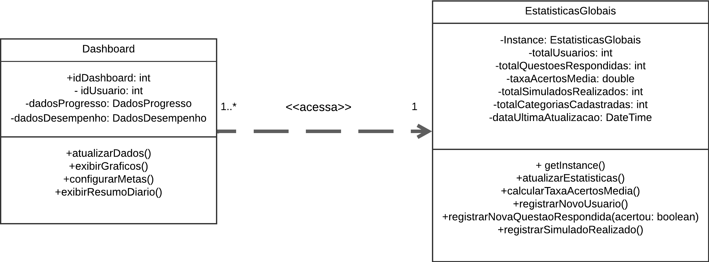
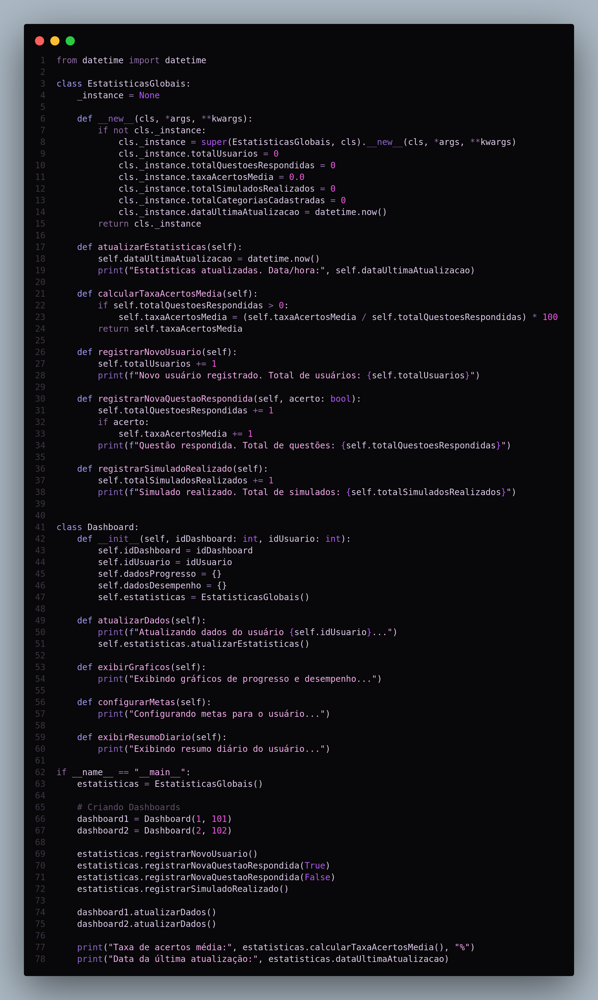
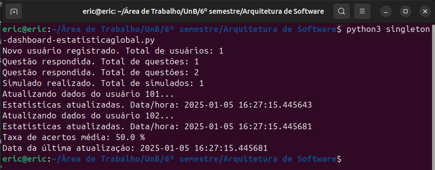

# **Documento de Padrão de Projeto GoF Criacional - Singleton**

## **1. Introdução**

Este documento apresenta o uso do padrão de projeto GoF criacional *Singleton* no contexto de um sistema que gerencia diversos *dashboards* para usuários e suas estatísticas globais. O *Singleton* se destaca por garantir que apenas uma única instância de determinada classe seja criada durante todo o ciclo de vida da aplicação, oferecendo um ponto de acesso global a recursos compartilhados. No caso em questão, essa abordagem assegura que os dados de estatísticas globais, como quantidade de usuários e taxa de acertos média, sejam consistentes em todos os *dashboards* e manipulados de forma centralizada.

A relevância teórica e prática desse padrão pode ser observada em diferentes perspectivas. Sob a ótica do *Model-View-Controller (MVC)*, em aplicações de grande porte é comum ter um controlador ou gerenciador centralizado que coordena recursos utilizados por várias *views* e modelos. Embora o *Singleton* não seja parte integrante do *MVC*, ele pode fornecer suporte quando existe a necessidade de instanciar apenas um objeto responsável por agrupar dados amplamente acessados pela aplicação. Ademais, do ponto de vista dos princípios *SOLID* — sobretudo o *Single Responsibility Principle (SRP)* e o *Open-Closed Principle (OCP)* — o *Singleton* pode ser benéfico se utilizado com cautela, evitando que ele se torne um ponto de acoplamento excessivo ou de múltiplas responsabilidades. Por outro lado, a adoção inadequada do *Singleton* pode infringir princípios de *Clean Architecture*, discutidos por Robert C. Martin (2017), se a classe única centralizar demasiadas lógicas de negócio.

Como base para o desenvolvimento, foram consideradas as proposições teóricas de Gamma, Helm, Johnson e Vlissides (1995), popularmente conhecidos como Gang of Four (GoF), que definiram o *Singleton* como um dos padrões de projeto criacionais mais relevantes. Também foram consultadas referências contemporâneas, como o repositório *Refactoring Guru*, que elabora exemplos práticos e discute aspectos positivos e negativos do *Singleton*, bem como o uso de padrões arquiteturais modernos para assegurar escalabilidade e alta coesão no desenvolvimento de aplicações (*FOWLER*, 2002). Neste documento, descrevemos como essa abordagem foi aplicada especificamente na classe **EstatisticasGlobais**, responsável por gerenciar dados críticos do sistema de *dashboards*.

## **2. Metodologia**

A elaboração deste documento seguiu uma metodologia de pesquisa teórico-prática que envolveu a coleta de informações sobre o padrão *Singleton* em literatura especializada e em portais de referência da indústria de software. Em seguida, realizou-se a modelagem UML do cenário para evidenciar onde o padrão se encaixa e, por fim, implementou-se o *Singleton* em linguagem Python, validando seu funcionamento com testes e estudos de caso.

### **2.1 Aplique a metodologia que deseja utilizar**

Para ilustrar o uso das metodologias de análise e design, optou-se pela junção de conceitos de *MVC* e do princípio de inversão de dependência do *SOLID*. Foi estabelecido que a camada de apresentação (interface do usuário) acessaria objetos de domínio (*Model*) cujos dados são centralizados pela classe *Singleton*, evitando redundâncias. Além disso, para alinhar-se ao princípio de responsabilidade única, a classe *Singleton* — denominada **EstatisticasGlobais** — se restringe ao armazenamento e à manipulação de métricas compartilhadas, delegando outras funcionalidades a componentes específicos (por exemplo, *Controllers* e *Views* do *MVC*). Tal decisão visa manter clara a divisão de responsabilidades e a legibilidade do código.

## **3. Modelagem e Contextualização do Singleton no Sistema**

O sistema em discussão oferece *dashboards* personalizados para cada usuário, exibindo estatísticas globais como total de usuários, taxa de acertos média e quantidade total de simulados realizados. A adoção do *Singleton* ocorre na classe **EstatisticasGlobais**, que consolida todos esses indicadores, provendo consistência de dados e eliminando a possibilidade de divergência entre *dashboards*.

A seguir, apresentamos o diagrama UML simplificado que ilustra a interação entre as classes **Dashboard** e **EstatisticasGlobais**. O *Dashboard* pode acessar e atualizar as métricas globais por meio da única instância de **EstatisticasGlobais**, garantindo que qualquer atualização seja refletida para todos os usuários em tempo real.

 

<figure markdown>

<b>Imagem 1</b> - Diagrama relacionado ao GOF Criacional - Singleton.

Fonte: [Ana Carolina](https://github.com/CarolCoCe), [Felipe de Oliveira](https://github.com/M0tt1nh4), [Giovanni Alvissus](https://github.com/giovanniacg) e [João Artur](https://github.com/joao-artl).

</figure>

### **3.1 Integração com MVC e Relacionamento com SOLID**

Dentro do padrão *MVC*, a classe **EstatisticasGlobais** pode ser encarada como parte do *Model*, uma vez que concentra informações e lógicas de atualização de métricas. Entretanto, deve-se atentar para que o *Singleton* não se transforme em uma “classe deus”, acumulando funcionalidades de controle ou de *view*. Essa segregação de responsabilidades mantém a aderência aos princípios do *SOLID*, particularmente o *Single Responsibility Principle (SRP)*, que prega que uma classe deve ter somente um motivo para mudar. Ademais, o *Singleton* não deve impedir a aplicação do *Open-Closed Principle (OCP)* — no caso de surgirem novas demandas de estatísticas, é importante extender comportamentos sem alterar drasticamente a estrutura atual.

## **4. Demonstração de Código e Exemplificação**

A seguir, apresentamos o código completo em Python que demonstra a implementação do padrão GoF Criacional *Singleton* aplicado à classe **EstatisticasGlobais**, bem como a classe **Dashboard** que a acessa. O método `__new__` assegura que apenas uma instância de **EstatisticasGlobais** seja criada, enquanto cada *dashboard* possui sua própria instância, porém compartilhando a mesma referência para as estatísticas. 

 

<figure markdown>

<b>Imagem 2</b> - Código relacionado ao GOF Criacional - Singleton.

Fonte: [Arthur Alves](https://github.com/Arthrok), [Diego Sousa](https://github.com/DiegoSousaLeite), [Julio Cesar](https://github.com/julio-dourado) e [Paulo Henrique](https://github.com/paulomh)

</figure>

 

Essa estrutura mostra um exemplo simplificado no qual cada *Dashboard* acessa a mesma instância de **EstatisticasGlobais**. Assim, quando um novo usuário é registrado em um dos *dashboards*, a contagem total de usuários é refletida para todos, evitando inconsistências e o retrabalho de sincronizar várias instâncias. Em termos arquiteturais, esse recurso pode ser benéfico sempre que se deseja compartilhar informações globais, mas recomenda-se cautela para não criar pontos de dependência excessiva em sistemas distribuídos ou em projetos onde a escalabilidade e o isolamento de contexto são prioritários.

 

<figure markdown>

<b>Imagem 3</b> - Saída do código de demonstração do Singleton.

Fonte: [Eric Silveira](https://github.com/ericbky)

</figure>

