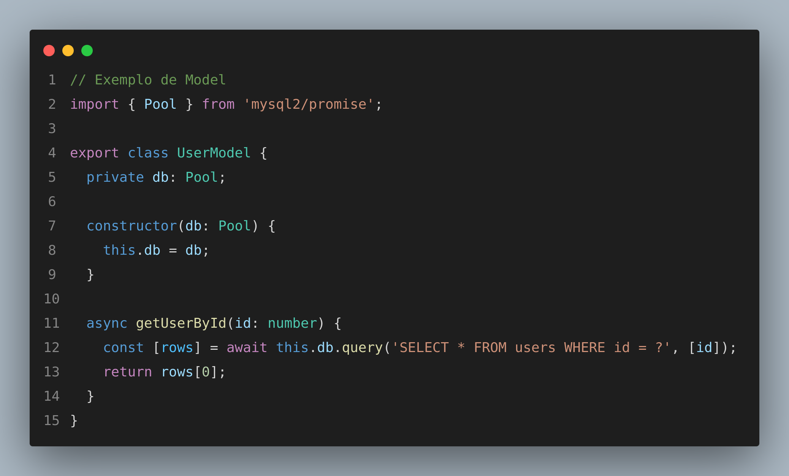
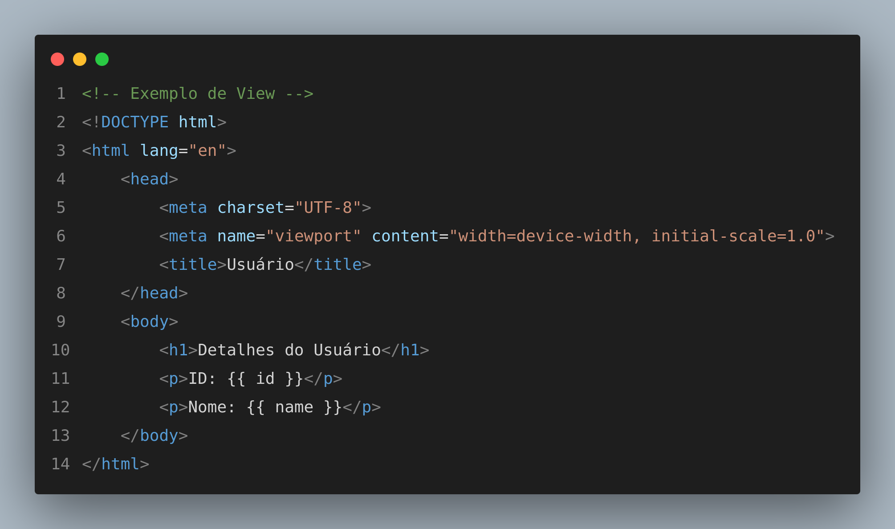
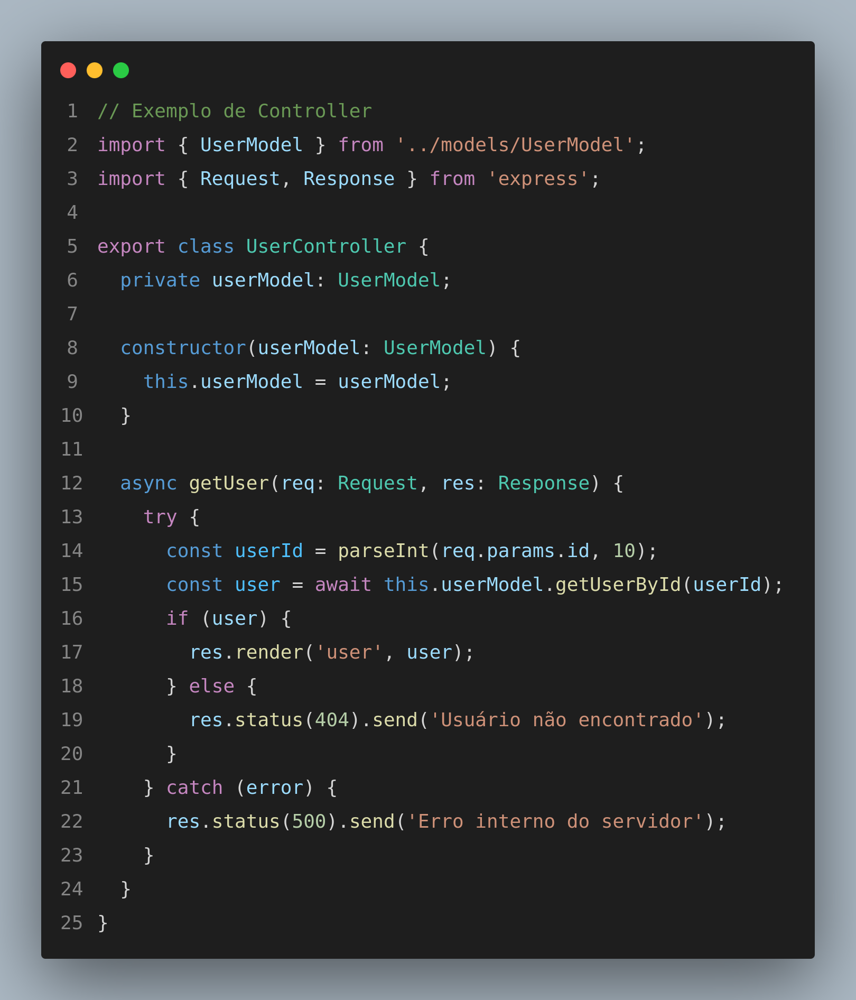

# **Padrão de Projeto MVC**

## **1. Introdução**

O Model-View-Controller (MVC) é um dos padrões de projeto mais amplamente utilizados no desenvolvimento de software, especialmente em aplicações web. Este documento apresenta uma visão geral sobre o padrão MVC, explorando seus conceitos, objetivos e vantagens. Também discutiremos como ele pode ser aplicado para melhorar a organização e a manutenção de projetos de software. Este artefato está relacionado a outras documentações sobre arquitetura de software e boas práticas de desenvolvimento.

## **2. Metodologia**

Para a elaboração deste documento, utilizamos uma abordagem teórica baseada em revisão bibliográfica e estudos de casos reais. As principais fontes incluem livros sobre engenharia de software, artigos científicos e documentação oficial de frameworks que implementam o padrão MVC.

### **2.1 Aplique a metodologia que deseja utilizar**

A metodologia aplicada consistiu em:

- Identificar os conceitos fundamentais do padrão MVC.
- Analisar frameworks populares que utilizam MVC (e.g., Ruby on Rails, Spring, Laravel).
- Organizar o conteúdo de forma clara e didática para facilitar o entendimento dos leitores.

## **3. Estrutura do Padrão MVC**

O padrão MVC é composto por três componentes principais:

### **3.1 Model**

O Model é responsável pela lógica de negócio e pelo gerenciamento dos dados da aplicação. Ele:

- Define como os dados são estruturados e manipulados.
- Comunica-se com o banco de dados ou outras fontes de dados externas.
- Fornece APIs para que os Controladores acessem os dados.

<figure markdown>

<b>Imagem 1 -</b> Exemplo Model

Fonte: [Gustavo Melo](https://github.com/gusrberto) e [Danilo Naves](https://github.com/DaniloNavesS)

</figure>

### **3.2 View**

A View é responsável pela interface do usuário e pela apresentação dos dados. Ela:

- Recebe dados do Controlador e os exibe ao usuário.
- É independente da lógica de negócio.
- Pode incluir templates, arquivos HTML, CSS e JavaScript.

<figure markdown>

<b>Imagem 2 -</b> Exemplo View

Fonte: [Gustavo Melo](https://github.com/gusrberto) e [Danilo Naves](https://github.com/DaniloNavesS)

</figure>

### **3.3 Controller**

O Controller é o intermediário entre o Model e a View. Ele:

- Processa as requisições do usuário.
- Invoca os métodos do Model para manipular dados.
- Passa os dados processados para a View.

<figure markdown>

<b>Imagem 3 -</b> Exemplo Controller

Fonte: [Gustavo Melo](https://github.com/gusrberto) e [Danilo Naves](https://github.com/DaniloNavesS)

</figure>

## **4. Benefícios do Padrão MVC**

O uso do MVC oferece diversos benefícios, incluindo:

- **Separação de responsabilidades**: Cada componente tem uma função bem definida, facilitando a manutenção e a expansão do sistema.
- **Reutilização de código**: O Model pode ser reutilizado em diferentes Views.
- **Facilidade de teste**: A separação dos componentes simplifica a criação de testes unitários.

## **5. Análise e Conclusão**

O padrão MVC é uma abordagem robusta para organização de aplicações, promovendo a manutenção e a escalabilidade. Ele é amplamente adotado em frameworks modernos devido à sua capacidade de separar responsabilidades de forma clara. Para próximos passos, recomenda-se:

- Explorar frameworks que implementam MVC.
- Estudar casos de uso reais para compreender suas aplicações práticas.
- Implementar projetos práticos utilizando MVC.

## **Referências Bibliográficas**

- 1. Gamma, E., Helm, R., Johnson, R., & Vlissides, J. (1994). *Design Patterns: Elements of Reusable Object-Oriented Software*. Addison-Wesley.
- 2. Fowler, M. (2002). *Patterns of Enterprise Application Architecture*. Addison-Wesley.
- 3. Laravel. (n.d.). *The PHP Framework for Web Artisans*. Disponível em: [https://laravel.com/](https://laravel.com/). Acesso em: 03 jan. 2025.

## **Histórico de Versão**

| Versão | Data | Data de Revisão | Descrição | Autor(es) | Revisor(es) | Detalhes da revisão |
| --- | --- | --- | --- | --- | --- | --- |
| `1.0` | 03/01/2025 | 03/01/2025 | Criação do documento | [Gustavo Melo](https://github.com/gusrberto) e [Danilo Naves](https://github.com/DaniloNavesS) | [Eric Silveira](https://github.com/ericbky) e [Luiz Gustavo](https://github.com/LuizGust4vo) | [#4](https://github.com/UnBArqDsw2024-2/2024.2_G3_Aprender_Entrega_03/pull/4) |
| `1.1` | 05/01/2025 | 05/01/2025 | Adicionando referências e fontes imagens | [Gustavo Melo](https://github.com/gusrberto) e [Danilo Naves](https://github.com/DaniloNavesS) | [Eric Silveira](https://github.com/ericbky) e [Luiz Gustavo](https://github.com/LuizGust4vo) | [#4](https://github.com/UnBArqDsw2024-2/2024.2_G3_Aprender_Entrega_03/pull/4) |