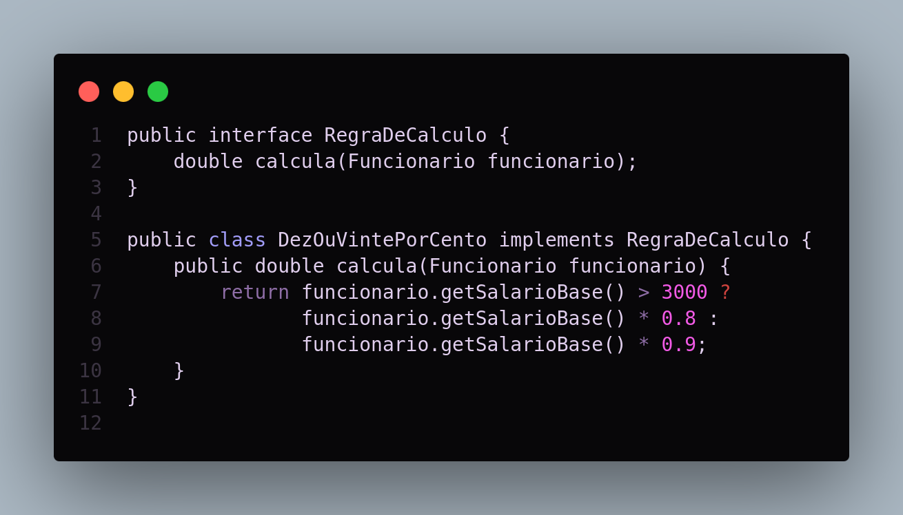
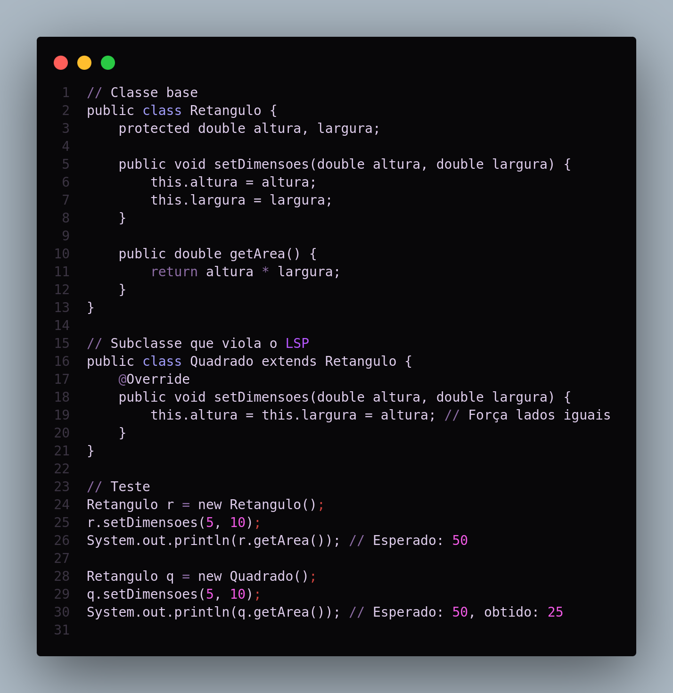
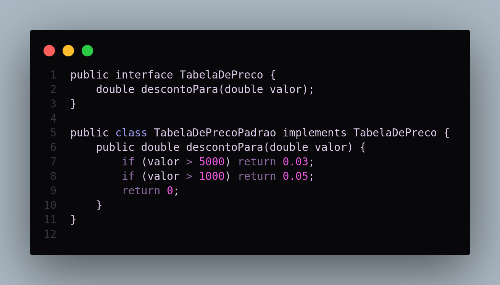
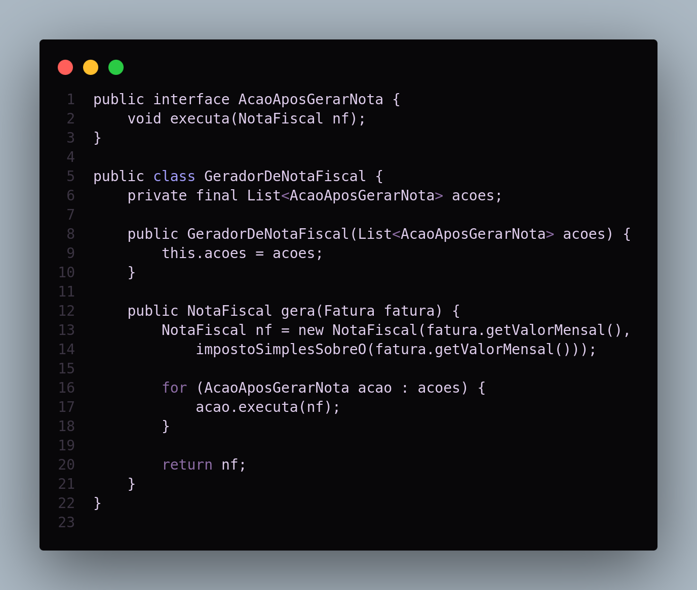

# **Princípios SOLID na Orientação a Objetos**

## **1. Introdução**

Este documento tem por finalidade apresentar e aprofundar a compreensão acerca dos princípios SOLID, amplamente reconhecidos como pilares no desenvolvimento de sistemas orientados a objetos. Concebidos por Robert C. Martin, tais princípios fornecem diretrizes para que o código seja mais coeso, flexível e, acima de tudo, fácil de manter e evoluir ao longo do tempo.

A relevância deste tema se intensifica na atual conjuntura, em que as rápidas transformações tecnológicas e de mercado exigem que aplicações sejam escaláveis e passíveis de adaptação às constantes mudanças de requisitos. Dessa forma, a adoção dos princípios SOLID favorece a criação de projetos robustos, sustentáveis e prontos para suportar modificações incrementais, sem perda de qualidade ou necessidade de grandes reestruturações.

Para embasar esta apresentação, foi utilizada como referência a obra *Orientação a Objetos e SOLID para Ninjas: Projetando Classes Flexíveis*, complementada por artigos especializados em design de software e boas práticas de programação. Essa base bibliográfica possibilita uma exploração consistente dos fundamentos de cada princípio, bem como dos benefícios inerentes à sua aplicação.

## **2. Metodologia**

A estruturação deste documento se deu a partir de uma abordagem qualitativa, por meio da análise de textos de referência e artigos técnicos que discorrem sobre os princípios SOLID. Foram igualmente considerados exemplos de código extraídos e adaptados de projetos reais, permitindo a demonstração prática de cada diretriz no contexto do desenvolvimento de software.

### **2.1 Aplique a metodologia que deseja utilizar**

Partindo do levantamento bibliográfico, buscou-se identificar e correlacionar os conceitos descritos nos livros e artigos com situações cotidianas de projeto. A seguir, promoveu-se uma organização sistemática dos princípios, de modo a explorar detalhadamente cada um e evidenciar como podem ser incorporados nas rotinas de programação. Por fim, a análise de código serviu como estudo de caso, ilustrando a adoção das diretrizes SOLID na resolução de problemas comuns.

## **3. Fundamentos dos Princípios SOLID**

Os princípios SOLID são resumidos em cinco diretrizes, cada uma tratando de um aspecto fundamental do design de software orientado a objetos. De forma geral, eles visam tornar o código mais legível, robusto e sustentável ao longo de todo o ciclo de vida do sistema. A seguir, cada princípio será descrito e exemplificado:

### **3.1 Single Responsibility Principle (SRP)**

O Princípio da Responsabilidade Única estabelece que cada classe deve ter apenas uma razão para sofrer modificações, ou seja, deve responder por um único objetivo ou responsabilidade dentro do sistema. Essa delimitação impede que uma classe centralize múltiplas preocupações, evitando, por consequência, acoplamentos indevidos e dificuldade de manutenção.

*Exemplo Prático:*

Suponha a necessidade de calcular o salário de funcionários com base em diferentes regras de negócio. A adoção do SRP pode ser observada no seguinte trecho de código:

<figure markdown>

<b>Imagem 1</b> - Exemplo de código adotando SRP.

Fonte: [Eric Silveira](https://github.com/ericbky) e [Luiz Gustavo](https://github.com/LuizGust4vo)

</figure>

Observa-se que cada classe é responsável por uma tarefa específica: a interface **RegraDeCalculo** define o contrato para o cálculo salarial, enquanto a classe **DezOuVintePorCento** implementa uma regra específica. Caso surjam novas regras de negócio, basta criar novas classes que atendam ao mesmo contrato, preservando a coesão e a facilidade de manutenção.

### **3.2 Open/Closed Principle (OCP)**

O Princípio Aberto/Fechado recomenda que as classes sejam abertas para extensão, mas fechadas para modificação. Isso significa que a funcionalidade de um sistema pode ser expandida sem necessidade de alterar o código fonte existente, minimizando riscos de introduzir regressões ou inconsistências.

*Exemplo:*

No caso da implementação de diferentes tabelas de preços, pode-se empregar interfaces para habilitar a extensão:

<figure markdown>

<b>Imagem 2</b> - Exemplo de código adotando OCP.

Fonte: [Eric Silveira](https://github.com/ericbky) e [Luiz Gustavo](https://github.com/LuizGust4vo)

</figure>

A criação de uma nova tabela de preços pode ser feita simplesmente por meio de outra implementação de **TabelaDePreco**, preservando o comportamento já existente na aplicação. Tal estratégia atenua a necessidade de refatoração e confere ao sistema maior adaptabilidade.

### **3.3 Liskov Substitution Principle (LSP)**

O Princípio da Substituição de Liskov determina que subclasses devem poder substituir suas classes-pai sem que haja prejuízo ao comportamento esperado do sistema. Em termos práticos, significa que qualquer classe derivada deve comportar-se de forma consistente com sua superclasse, respeitando contratos e expectativas.

*Exemplo Clássico:*

O caso do “Quadrado e Retângulo” exemplifica a violação do LSP. Ao criar uma classe **Quadrado** que herda de **Retangulo**, alterando o comportamento de setAltura e setLargura para manter valores iguais, quebra-se a compatibilidade entre tipos, infringindo o princípio. Projetos bem elaborados, por outro lado, asseguram a substituibilidade sem alterações indesejadas.

<figure markdown>

<b>Imagem 3</b> - Exemplo de código adotando LSP.

Fonte: [Eric Silveira](https://github.com/ericbky) e [Luiz Gustavo](https://github.com/LuizGust4vo)

</figure>

### **3.4 Interface Segregation Principle (ISP)**

O Princípio da Segregação de Interfaces sustenta que interfaces extensas ou genéricas demais podem gerar classes que implementem métodos sem relevância para suas tarefas. Para evitar essa sobrecarga, recomenda-se a criação de interfaces menores e mais específicas, direcionadas às necessidades de cada cliente.

*Exemplo:*

Ao invés de criar uma única interface com métodos de leitura e escrita, pode-se dividi-la em duas interfaces menores:

<figure markdown>

<b>Imagem 4</b> - Exemplo de código adotando ISP.

Fonte: [Eric Silveira](https://github.com/ericbky) e [Luiz Gustavo](https://github.com/LuizGust4vo)

</figure>

Essa segregação permite que classes implementem apenas os métodos que realmente utilizam, favorecendo a simplicidade e tornando o código mais coeso e compreensível.

### **3.5 Dependency Inversion Principle (DIP)**

Por fim, o Princípio da Inversão de Dependência recomenda que classes de alto nível não dependam de classes de baixo nível, mas sim de abstrações. Dessa maneira, toda a arquitetura fica mais modular e adaptável às mudanças, pois basta alterar a implementação subjacente sem modificar quem a utiliza.

*Exemplo:*

A seguir, tem-se o exemplo de um gerador de notas fiscais que realiza uma série de ações após criar uma nova instância de **NotaFiscal**:

<figure markdown>

<b>Imagem 5</b> - Exemplo de código adotando DIP.

Fonte: [Eric Silveira](https://github.com/ericbky) e [Luiz Gustavo](https://github.com/LuizGust4vo)

</figure>

Ao depender de uma lista de abstrações (neste caso, **AcaoAposGerarNota**), a classe **GeradorDeNotaFiscal** pode receber diversas implementações de ação sem precisar ser alterada. A inclusão de novas regras, por exemplo, segue o mesmo contrato definido pela interface, tornando o processo de extensão simples e seguro.

## **4. Exemplos Práticos e Aplicações**

A aplicação sistemática dos princípios SOLID em cenários reais traz benefícios tangíveis em termos de clareza, robustez e facilidade de evolução do sistema. Em projetos de longo prazo, essas vantagens tornam-se ainda mais evidentes, pois a base de código permanece organizada e resiliente a mudanças de requisitos. A adoção de técnicas como Inversão de Controle (IoC), Injeção de Dependência (DI) e testes unitários complementam a efetividade dos princípios SOLID, garantindo que cada componente seja testável e minimamente acoplado.

O desenvolvimento de microserviços, por exemplo, pode se beneficiar amplamente desses princípios ao projetar serviços coesos, bem definidos e orientados a contratos claros (interfaces), o que facilita a evolução contínua sem retrabalho ou refatorações onerosas.

## **5. Análise e Conclusão**

A adoção dos princípios SOLID na orientação a objetos configura-se como um diferencial significativo para qualquer equipe ou organização que almeje construir sistemas de qualidade. Ao longo deste documento, foi exposto como cada princípio atua em prol da alta coesão, do baixo acoplamento e da capacidade de extensão do código, resultando em projetos mais robustos, modulares e de fácil manutenção.

Como próximos passos, recomenda-se a continuidade de estudos acerca de padrões de projeto (Design Patterns) que, em conjunto com os princípios SOLID, possibilitam a criação de arquiteturas ainda mais elegantes e escaláveis. A adoção de testes de unidade e boas práticas de DevOps também se faz relevante para maximizar os benefícios desses princípios. Em suma, os fundamentos SOLID são um ponto de partida seguro para quem deseja aprimorar a qualidade do software e a maturidade na engenharia de projetos orientados a objetos.

## **Referências Bibliográficas**

- 1. Aniche, M. (2021). *Orientação a Objetos e SOLID para Ninjas: Projetando Classes Flexíveis*. Casa do Código.
- 2. Medium. *O que é SOLID? O Guia Completo*. Disponível em: <[https://medium.com/desenvolvendo-com-paixao/o-que-é-solid-o-guia-completo-para-você-entender-os-5-princípios-da-poo-2b937b3fc530](https://medium.com/desenvolvendo-com-paixao/o-que-%C3%A9-solid-o-guia-completo-para-voc%C3%AA-entender-os-5-princ%C3%ADpios-da-poo-2b937b3fc530)>. Acesso em: 03/01/2025.
- 3. Digital Ocean. *SOLID: The First Five Principles of Object-Oriented Design*. Disponível em: <https://www.digitalocean.com/community/conceptual-articles/s-o-l-i-d-the-first-five-principles-of-object-oriented-design>. Acesso em: 03/01/2025.

## **Histórico de Versão**

| Versão | Data | Data de Revisão | Descrição | Autor(es) | Revisor(es) | Detalhes da revisão |
| --- | --- | --- | --- | --- | --- | --- |
| 1.0 | 03/01/2025 | 04/01/2025 | Criação do documento. | [Eric Silveira](https://github.com/ericbky) e [Luiz Gustavo](https://github.com/LuizGust4vo) | [Gustavo Melo](https://github.com/gusrberto) e [Danilo Naves](https://github.com/DaniloNavesS) | [#5](https://github.com/UnBArqDsw2024-2/2024.2_G3_Aprender_Entrega_03/pull/5) |
| 1.1 | 03/01/2025 | 04/01/2025 | Adicionando exemplos por código e referências bibliográficas. | [Eric Silveira](https://github.com/ericbky) e [Luiz Gustavo](https://github.com/LuizGust4vo) | [Gustavo Melo](https://github.com/gusrberto) e [Danilo Naves](https://github.com/DaniloNavesS) | [#5](https://github.com/UnBArqDsw2024-2/2024.2_G3_Aprender_Entrega_03/pull/5) |
| 1.2 | 04/01/2025 | 04/01/2025 | Ajustando PATH dreferentes as imagens. | [Eric Silveira](https://github.com/ericbky) e [Luiz Gustavo](https://github.com/LuizGust4vo) | [Gustavo Melo](https://github.com/gusrberto) e [Danilo Naves](https://github.com/DaniloNavesS) | [#5](https://github.com/UnBArqDsw2024-2/2024.2_G3_Aprender_Entrega_03/pull/5) |