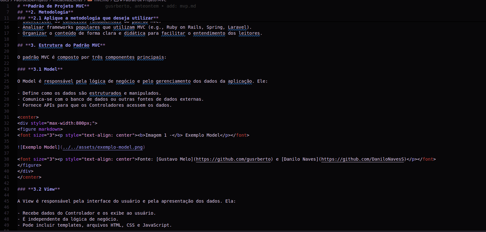
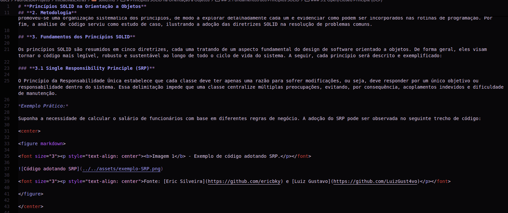

# Projeto G3_Aprender

**Código da Disciplina**: FGA0208  
**Número do Grupo**: 03  
**Entrega**: 03  

## Alunos

| Matrícula   | Aluno                                 | GitHub Profile                                                                              |
| ----------- | ------------------------------------- | --------------------------------------------------------------------------------------------|
| 190101750   | [Ana Carolina](https://github.com/CarolCoCe)         |        |
| 222037657   | [Arthur Alves](https://github.com/Arthrok)           |          |
| 221022515   | [Danilo Naves](https://github.com/DaniloNavesS)      |     |
| 221007994   | [Diego Sousa](https://github.com/DiegoSousaLeite)    |  |
| 221022266   | [Eric Silveira](https://github.com/ericbky)          |          |
| 221031158   | [Felipe de Oliveira](https://github.com/M0tt1nh4)    |         |
| 211043647   | [Giovanni Giampauli](https://github.com/giovanniacg)  |      |
| 211039457   | [Gustavo Melo](https://github.com/gusrberto)         |        |
| 221031185   | [João Artur](https://github.com/joao-artl)           |        |
| 211030809   | [Julio Cesar](https://github.com/julio-dourado)      |    |
| 221022669   | [Luiz Gustavo](https://github.com/LuizGust4vo)       |      |
| 221022417   | [Paulo Henrique](https://github.com/paulomh)         |          |

## Sobre 

Nesta terceira entrega, o grupo abordou o **Padrão GoF Comportamental** e explorou o **Padrão Strategy**, com foco na modelagem e implementação em um contexto prático. Esse padrão foi escolhido devido à sua capacidade de promover flexibilidade ao sistema, permitindo que diferentes comportamentos possam ser aplicados dinamicamente em tempo de execução.

A implementação foi contextualizada em um sistema de simulados, no qual diferentes estratégias de configuração e gerenciamento de simulados foram aplicadas, como estratégias padrão e personalizadas. O trabalho foi realizado com base no livro **Design Patterns: Elements of Reusable Object-Oriented Software** e em materiais complementares, como tutoriais e documentações de padrões de projeto.

## Screenshots da Terceira Entrega

### 3.5.1. MVC

Abaixo algumas screenshots dos princípios MVC, que foram abordados e exemplificados como mostra a screenshot a seguir:

<figure markdown>

<b>Imagem 1</b> - Screenshot MVC.

Fonte: [Eric Silveira](https://github.com/ericbky)

</figure>

### 3.5.2. SOLID

Abaixo algumas screenshots dos princípios SOLID, que foram abordados e exemplificados como mostra a screenshot a seguir:

<figure markdown>

<b>Imagem 2</b> - Screenshot SOLID.

Fonte: [Eric Silveira](https://github.com/ericbky)

</figure>

## Há algo a ser executado?

( ) SIM
**(X) NÃO**  

## Informações Complementares 

O grupo também produziu artefatos extras relacionados a estudos sobre **MVC** e **princípios SOLID**, conectando esses conceitos aos padrões de projeto trabalhados para construir um sistema robusto e escalável.  